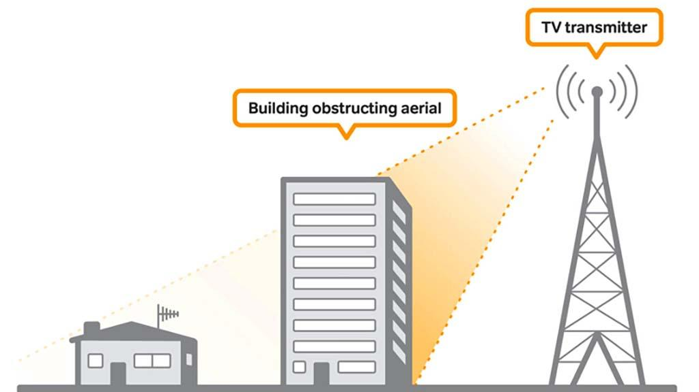

# OSI Layers 1 & 2 — Physical & Data Link

> Scope: how raw bits become signals on a wire or in the air, and how those bits are
> grouped into frames and delivered between two directly connected devices.
>
> Source: extracted and reorganised from `md/DOCUMENTATIONS ...md` → `SYSTEM_DESIGN vs BACKEND` →
> `PREVIOUS, OSI LAYERS, API DESIGN, Networking Essentials` → `OSI layers-(Open System Interconnection)`.

---

## 0. Where these layers sit

| # | Layer | PDU (unit of data) | Address used | Typical devices |
| --- | --- | --- | --- | --- |
| 2 | Data Link | Frame | MAC address | Switch, bridge, NIC, wireless access point |
| 1 | Physical | Bit / symbol | none | Cable, repeater, hub, transceiver, modem |

Encapsulation on the way down:

```
Application data
   ↓  Transport   → segment  (+ TCP/UDP header)
   ↓  Network     → packet   (+ IP header)
   ↓  Data Link   → frame    (+ MAC header + trailer/FCS)
   ↓  Physical    → bits     → signal on the medium
```

The two layers are inseparable in practice. Every byte that leaves any device passes
through the Physical layer, including traffic that never leaves the local network.

---

# 1. Physical Layer (Layer 1)

## 1.1 Definition

- Responsible for transferring **raw data bits** between the nodes of endpoints.
- Handles physical and electrical data transmission.
- Includes cables, connectors, plugs, receivers, transceivers.
- Defines hardware standards, voltage levels, pin layouts, and signal types.

It carries **no addressing and no meaning**. It moves 1s and 0s and nothing else.

## 1.2 Core functionality

### Encoding
Converts data into signals that can travel through copper wire, fibre optics, or a
wireless channel.

### Decoding
Turns those signals back into data at the receiver.

### Modem — MOdulator / DEModulator
The most common device that performs both jobs to connect a home to the internet.

| Term | Meaning |
| --- | --- |
| Modulation | Converting `010101` into a signal |
| Demodulation | Converting the signal back into `010101` |
| Carrier wave | A base wave whose properties are modified to carry the data |

## 1.3 Modulation techniques

A **carrier wave** has three properties that can be changed to encode bits.

| Technique | What changes | Encoding |
| --- | --- | --- |
| ASK — Amplitude Shift Keying | Height of the wave | `1` = high amplitude, `0` = low amplitude |
| FSK — Frequency Shift Keying | Frequency of the wave | `1` and `0` are two different frequencies |
| PSK — Phase Shift Keying | Phase of the wave | `1` and `0` are phase-shifted versions |
| QAM — Quadrature Amplitude Modulation | Amplitude **and** phase together | Several bits per symbol; used by WiFi, LTE, cable |

So under ASK, bits are encoded as **strong signal vs weak signal**.

## 1.4 How multiple signals are separated

Signals sharing the same medium are kept apart by **multiplexing**:

- **Cable / DSL / radio** → often by **frequency** (FDM, Frequency Division Multiplexing).
- **Modern networks (WiFi, 4G/5G)** → a **combination**: frequency + time slots + codes.

Key point: frequency alone is not the main mechanism in modern systems. Frequency,
time, and coding are used together (OFDMA in WiFi 6 and 5G is exactly this).

## 1.5 Where does one bit end and the next begin?

If the signal is continuous, how do we know how many bits it holds?

> Bits are determined by **time intervals**, not by signal length. A long signal is split
> into multiple bits based on the data rate.

You do **not** decide the interval dynamically. It is predefined by the data rate:

```
bit interval = 1 / data rate
```

If the link is 1 Mbps = 1,000,000 bits per second, then 1 bit = 1 microsecond.

### Data-rate → bit-interval table

| Data rate | Bits per second | Time per bit (interval) |
| --- | --- | --- |
| 1 bps | 1 | 1 second |
| 1 Kbps | 1,000 | 1 millisecond (ms) |
| 10 Kbps | 10,000 | 0.1 ms (100 µs) |
| 100 Kbps | 100,000 | 10 µs |
| 1 Mbps | 1,000,000 | 1 µs |
| 10 Mbps | 10,000,000 | 0.1 µs (100 ns) |
| 100 Mbps | 100,000,000 | 10 ns |
| 1 Gbps | 1,000,000,000 | 1 ns |
| 10 Gbps | 10,000,000,000 | 0.1 ns |

Faster speed = smaller interval. Sender and receiver stay aligned using **clock timing
and encoding rules** (line codes such as Manchester or 8b/10b embed a clock in the
signal so the receiver can recover timing).

## 1.6 Transmission modes



| Mode | Direction | Example |
| --- | --- | --- |
| Simplex | One way only | Keyboard → computer, TV broadcast |
| Half duplex | Two way, but one at a time | Walkie-talkie, old Ethernet hub |
| Full duplex | Two way simultaneously | TCP, WebSocket, modern switched Ethernet |

Important correction found in the source notes: **duplex mode is not decided by the
Data Link layer per connection**. It is determined by the hardware and network design.
TCP already provides full-duplex communication at Layer 4, and WebSocket is full duplex
on top of it.

## 1.7 Layer 1 standards and protocols

- **Ethernet (IEEE 802.3)** — widely used for wired networks.
- **Wi-Fi (IEEE 802.11)** — wireless communication.
- **Bluetooth (IEEE 802.15.1)** — short-range wireless.
- **USB (Universal Serial Bus)** — device connection over short distances.

Note these standards straddle Layers 1 and 2: they define both the signalling (L1) and
the framing / media access rules (L2).

## 1.8 Physical layer security

| Threat | Description |
| --- | --- |
| Cable tapping | Attacker intercepts data by connecting directly to network cables |
| Physical access | Entry to server rooms or hardware areas allows theft or damage |
| Wireless signal interception | WiFi signals captured from outside with special tools |
| Hardware manipulation | Tampering with routers or USB ports to install harmful software |

Defence is physical: locked racks, port security, tamper-evident seals, and encryption
at higher layers so a tapped cable yields only ciphertext.

---

# 2. Data Link Layer (Layer 2)

## 2.1 Responsibility

- Responsible for the **node-to-node delivery** of data within the same local network.
- Major role is to ensure **error-free transmission** of information.
- Also responsible for encoding, decoding, and organising outgoing and incoming data.
- Considered the **most complex layer** of the OSI model, because it hides all the
  underlying hardware complexity from the layers above.

**Node-to-node delivery** means communication between directly connected devices using
MAC addresses, not end-to-end delivery across the internet.

A correction from the notes: the Data Link layer does not "transfer data from" the
Physical layer. The Physical layer sends and receives bits; the Data Link layer
**frames and unframes** them.

## 2.2 The two sublayers

### Logical Link Control (LLC)
Deals with multiplexing, the flow of data among applications and other services, and is
responsible for providing **error messages and acknowledgments**.

### Media Access Control (MAC)
Manages the device's interaction with the medium, is responsible for **addressing
frames**, and controls physical media access. It receives information in the form of
**packets** from the Network layer, divides packets into **frames**, and sends those
frames bit-by-bit to the underlying Physical layer.

## 2.3 Frame structure (Ethernet II)

```
+----------+----------+---------+-------------------+-----+
| Dest MAC | Src MAC  | Type    | Payload (46-1500) | FCS |
|  6 bytes | 6 bytes  | 2 bytes |      bytes        |  4  |
+----------+----------+---------+-------------------+-----+
```

- **Dest / Src MAC** — 48-bit hardware addresses.
- **Type** — what is inside (0x0800 = IPv4, 0x86DD = IPv6, 0x0806 = ARP).
- **FCS** — Frame Check Sequence, a CRC-32 used for **error detection**. A frame that
  fails the check is dropped, not repaired.

The 1500-byte payload limit is the standard Ethernet **MTU**, which is why the Network
layer above may need to fragment.

## 2.4 MAC address resolution in a LAN — the ARP flow

You want to send data to `192.168.1.20`. You know the IP. You do **not** know the MAC.

**Step 1 — You only know the IP**
```
IP  = 192.168.1.20
MAC = unknown
```

**Step 2 — ARP Request (broadcast)**
Your laptop asks everyone: "Who has 192.168.1.20?"
Sent to `FF:FF:FF:FF:FF:FF`, the broadcast address, so every device in the LAN sees it.

**Step 3 — ARP Reply (unicast)**
The target laptop responds: "I have that IP. My MAC = `AA:BB:CC:DD:EE:FF`."

**Step 4 — Store in the ARP table**
```
192.168.1.20 → AA:BB:CC:DD:EE:FF
```
Cached for a few minutes so the broadcast is not repeated per packet.

**Step 5 — Create the data frame**
```
Source MAC      = your laptop's MAC
Destination MAC = target laptop's MAC
```

**Step 6 — Physical transmission**
The frame becomes electrical or radio signals and is sent through the switch, router,
or cable.

**Step 7 — Receiver gets it**
Checks the destination MAC. If it matches, it accepts the frame and passes the payload
up to IP → TCP → the application.

### One-line memory
> IP identifies the destination → ARP finds the MAC → frame is created → Physical layer
> sends signals → receiver accepts by MAC.

### Interview version
> "To send data in a local network, the device uses ARP to resolve the destination IP
> into a MAC address, stores it in the ARP cache, then encapsulates the data into an
> Ethernet frame and sends it via the Physical layer."

### Where the addresses come from

| Address | How the device gets it |
| --- | --- |
| Own MAC | Taken directly from the NIC hardware (burned in at manufacture) |
| Peer MAC | Resolved with ARP inside the LAN |
| Own IP | Usually from a DHCP server, or configured manually |
| Peer IP | From DHCP, static configuration, or DNS resolution |

Both addresses are needed at once: **IP identifies the final destination, MAC is used
for local hop delivery.**

## 2.5 Devices

### 1. Switch
- The key device of the Data Link layer.
- Uses MAC addresses to forward frames to the correct device.
- Works in local area networks to connect multiple devices.
- Builds a **MAC address table** by learning source addresses from incoming frames.

### 2. Bridge
- Connects two or more LANs into a single unified network.
- Operates at Layer 2 by forwarding frames based on MAC addresses.
- Used to reduce network traffic and segment a network.

### 3. Network Interface Card (NIC)
- Hardware component in computers, printers, and similar devices.
- Adds the MAC address to frames and handles communication with the network.

### 4. Wireless Access Point (WAP)
- Allows wireless devices to connect to a wired network.
- Manages wireless MAC addresses at Layer 2.
- Uses protocols like Wi-Fi (IEEE 802.11).

### 5. Layer 2 switches
- Specialised switches that operate only at Layer 2, unlike multilayer switches.
- Forward frames using MAC address tables.

> **Security note:** the Data Link layer can be targeted by attacks like **MAC spoofing**
> or **ARP poisoning**. Understanding how devices and frames operate at this layer helps
> detect and mitigate such threats. Mitigations include dynamic ARP inspection, port
> security, and 802.1X authentication.

## 2.6 Limitations

- **Limited scope** — operates only within a local network; cannot handle end-to-end
  communication across different networks.
- **Increased overhead** — headers, trailers, and redundant data for error correction
  increase transmitted size.
- **Error handling dependency** — can detect and correct some errors, but relies on
  upper layers for more complex issues.
- **No routing capability** — cannot make routing decisions; only ensures delivery
  within the same network segment.
- **Resource usage** — flow control and error correction consume extra processing power
  and memory.

## 2.7 Applications

- **Local Area Networks (LANs)** — reliable communication between devices using
  Ethernet (IEEE 802.3).
- **Wireless networks (Wi-Fi)** — communication via IEEE 802.11, handling media access
  and error control.
- **Switches and MAC addressing** — forwarding frames to the correct device.
- **Point-to-point connections** — protocols like PPP establish and manage direct
  communication between two nodes.

---

# 3. Q&A — Layers 1 & 2

### Signals and encoding

**How is binary converted to signals?**
By modulating a carrier wave, changing amplitude, frequency, or phase.

**How does modulation work?**
It encodes 0 and 1 by modifying properties of a signal wave.

**How are multiple signals separated?**
By using different frequencies, time slots, or codes.

**Is frequency mainly used?**
No. Modern systems use frequency, time, and coding together.

**How do we know how many bits are in a signal?**
By dividing the signal using fixed time intervals (bit duration).

**How is the bit interval decided?**
It is defined by the data rate in bits per second.

**Data rate table rule?**
Bit interval = 1 / data rate. Faster speed means a smaller interval.

**How does a modem convert 0 and 1?**
By encoding bits onto a carrier wave.

**How are bits separated from the signal?**
By using clock timing and encoding rules.

**What is a carrier wave?**
A base wave whose properties are modified to carry data.

### OSI and Data Link

**Are there 7 OSI layers?**
Yes, from Application at the top to Physical at the bottom.

**Does the Data Link layer control duplex mode?**
No. Duplex is determined by hardware and network design, not per connection.

**Simplex, half duplex, full duplex?**
One-way, two-way alternately, and two-way simultaneously.

**Is the Data Link layer node-to-node delivery?**
Yes. It handles delivery between directly connected devices.

**Does data skip the Physical layer inside the same network?**
No. All data always passes through the Physical layer.

**Does the Data Link layer add the MAC address?**
Yes. It adds source and destination MAC addresses in frames.

**How is the source MAC known?**
It is taken directly from the device's NIC hardware.

**How do we find another device's MAC?**
Using ARP: a broadcast request and a unicast reply.

**What is the ARP flow?**
Broadcast request → reply → store MAC → send frame.

**Is IP also used?**
Yes. IP identifies the destination, MAC is used for local delivery.

**How do we get an IP?**
Usually from a DHCP server, or by manual configuration.

**Is the Physical layer only in routers?**
No. It exists in every network device.

**Does the Data Link layer "transfer" data from the Physical layer?**
No. The Physical layer sends bits; the Data Link layer frames and unframes them.

**Does the Data Link layer decide direction after TCP?**
No. TCP already provides full-duplex communication.

**Is WebSocket full duplex?**
Yes. Both sides can send data simultaneously.

**What is node-to-node delivery?**
Communication between directly connected devices using MAC addresses.

---

# 4. Quick revision sheet

| Question | Layer 1 | Layer 2 |
| --- | --- | --- |
| Unit | Bit | Frame |
| Address | none | MAC (48-bit) |
| Job | Move signals | Node-to-node delivery, error detection |
| Error handling | none | CRC / FCS detection, drop on failure |
| Devices | Cable, hub, repeater, modem | Switch, bridge, NIC, WAP |
| Protocols | Ethernet PHY, 802.11 PHY, DSL, USB | Ethernet MAC, 802.11 MAC, PPP, ARP |
| Attacks | Cable tapping, signal interception | MAC spoofing, ARP poisoning |

**One sentence each**

- Layer 1 moves bits as signals over a medium and knows nothing about who they are for.
- Layer 2 groups bits into frames, addresses them with MAC, and delivers them across one
  hop of the local network.

---

**Next:** [OSI Layers 3 & 4 — Network & Transport](../OSI_LAYERS_3-4_NETWORK_TRANSPORT/README.md)
