# OSI Layers 3 & 4 — Network & Transport

> Scope: how packets find their way across many networks using IP addresses, and how
> processes on two different hosts hold a reliable, ordered conversation using ports.
>
> Source: extracted and reorganised from `md/DOCUMENTATIONS ...md` → `SYSTEM_DESIGN vs BACKEND` →
> `PREVIOUS, OSI LAYERS, API DESIGN, Networking Essentials` → `OSI layers-(Open System Interconnection)`.

---

## 0. Where these layers sit

| # | Layer | PDU | Address used | Devices |
| --- | --- | --- | --- | --- |
| 4 | Transport | Segment (TCP) / Datagram (UDP) | Port number | End hosts only |
| 3 | Network | Packet | IP address | Router, Layer 3 switch, gateway |

The pivotal distinction: **Layer 3 is hop-by-hop and lives in every router. Layer 4 is
end-to-end and exists only in the two end systems.** A router in the middle never opens
your TCP segment.

---

# 1. Network Layer (Layer 3)

## 1.1 Overall

- Handles **logical (IP) addressing** of devices.
- Determines **optimal routing paths** between networks.
- Enables **host-to-host communication** across multiple networks.
- Takes **segments** from the Transport layer.
- Adds an **IP header** containing source and destination IP.
- Wraps them into **packets**.

## 1.2 Responsibilities

- **Logical addressing** — assigns unique IP addresses to devices, ensuring accurate
  identification and communication across networks.
- **Packetization** — encapsulates transport layer segments into packets for efficient
  transmission.
- **Host-to-host delivery** — delivers packets from sender to intended receiver across
  diverse networks.
- **Forwarding** — moves packets from a router's input interface to the appropriate
  output interface based on the destination IP.
- **Routing** — determines the optimal path across multiple networks using routing
  algorithms and protocols.
- **Fragmentation and reassembly** — splits large packets into smaller fragments to
  match the MTU of a network, and reassembles them at the destination.
- **Subnetting** — divides larger networks into smaller subnetworks for efficient
  addressing and traffic management.
- **NAT (Network Address Translation)** — maps private IPs to public IPs for internet
  communication, conserving address space and adding security.

## 1.3 MTU — Maximum Transmission Unit

- The amount of data one packet can carry.
- On Ethernet it is **1500 bytes**, that is 1500 × 8 = 12,000 bits.
- A packet larger than the MTU of the next link must be **fragmented**, which costs
  processing time and risks total loss if any fragment is dropped.
- Path MTU Discovery is how modern stacks avoid fragmentation: they probe for the
  smallest MTU on the path and size packets to fit.

## 1.4 IPv4 header at a glance

```
0                   1                   2                   3
|Version|  IHL  |Type of Service|          Total Length         |
|         Identification        |Flags|    Fragment Offset      |
| Time to Live  |    Protocol   |        Header Checksum        |
|                       Source IP Address                       |
|                    Destination IP Address                     |
|                    Options (optional)                         |
```

- **Version** — 4 or 6.
- **TTL** — decremented at each hop; at zero the packet is dropped. Prevents infinite
  routing loops and is what `traceroute` exploits.
- **Protocol** — what is inside: 6 = TCP, 17 = UDP, 1 = ICMP.
- **Identification / Flags / Fragment Offset** — used to reassemble fragments.
- Minimum header size is **20 bytes** without options.

### Why 8 bits per byte?
2⁸ = 256 possible values, enough to represent characters, numbers, and symbols. This is
why an IPv4 address, made of four 8-bit octets, has each part in the range 0–255.

## 1.5 Reference diagrams

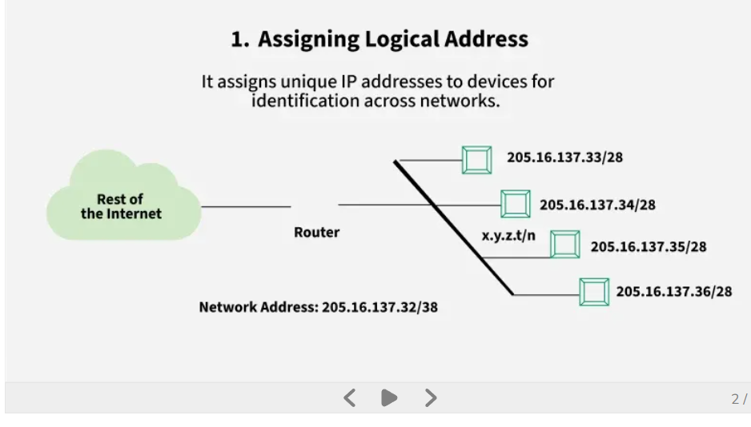
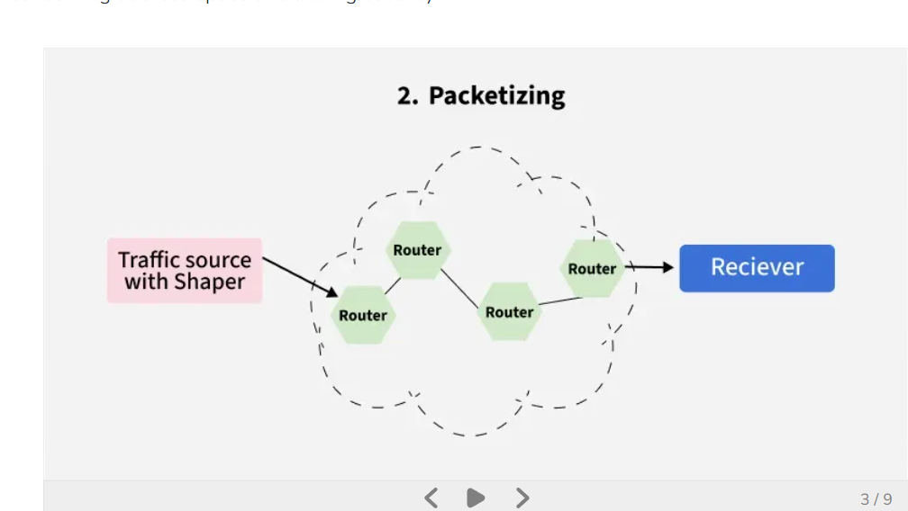
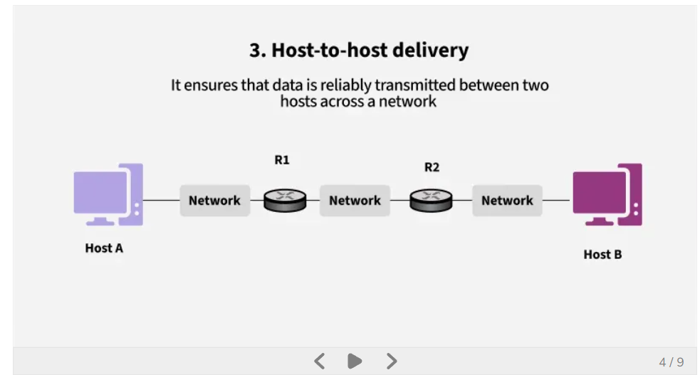
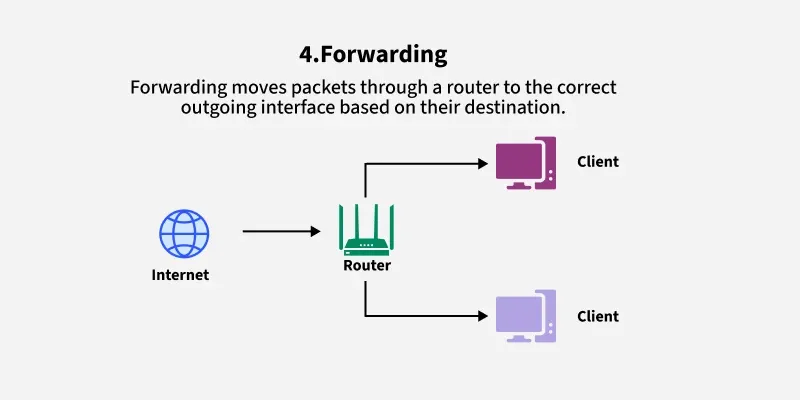
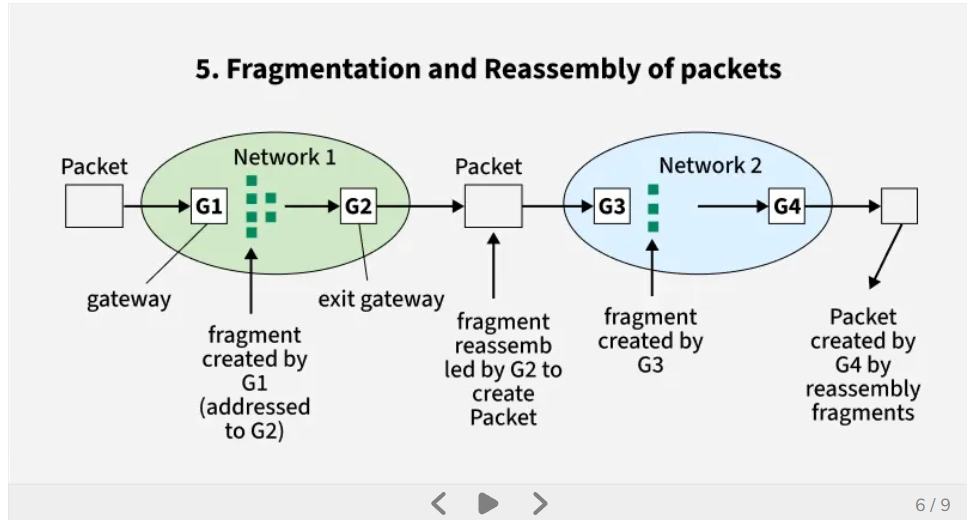
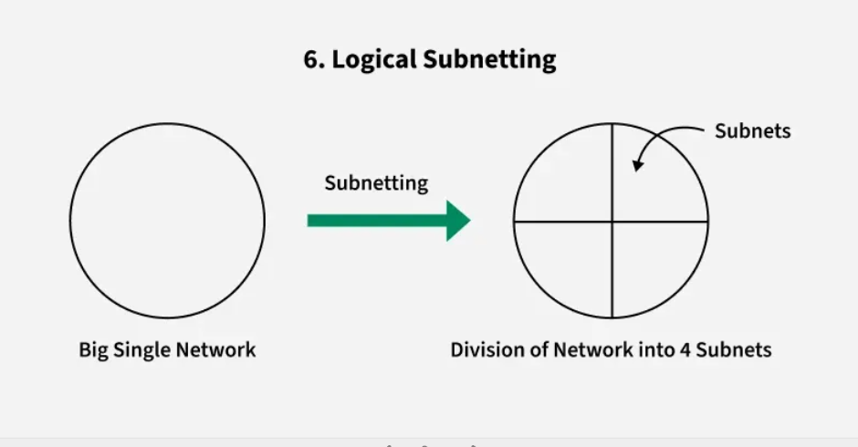
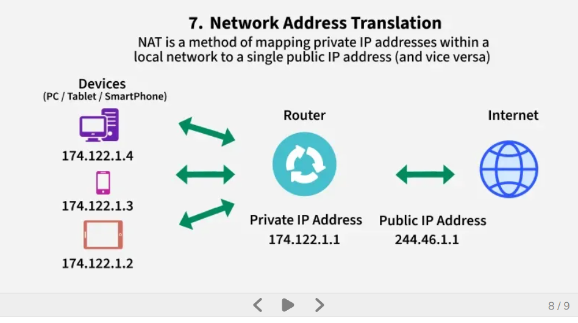
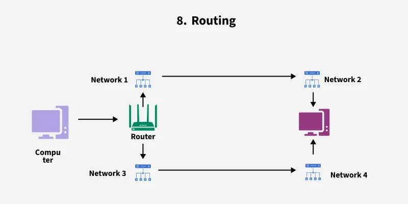

## 1.6 Devices

> **Network layer = routing between different networks using IP addresses.**

1. **Router** — the most important one. Connects distinct networks and forwards packets
   based on its routing table.
2. **Layer 3 switch (multilayer switch)** — switches at wire speed but can also route
   between VLANs.
3. **Gateway** — a concept device. Your **default gateway** is the exit point of your
   network, used whenever the destination is not in your local subnet.

## 1.7 Protocols

- **IP (Internet Protocol, IPv4 / IPv6)** — the addressing and delivery protocol itself.
- **ICMP (Internet Control Message Protocol)** — sends error reports and diagnostic
  messages, for example destination unreachable, and ping.
- **ARP (Address Resolution Protocol)** — maps IP addresses to MAC addresses within a
  local network. Sits at the L2/L3 boundary.
- **RARP (Reverse Address Resolution Protocol)** — retrieves a device's IP address using
  its MAC address. Largely obsolete, replaced by DHCP.
- **NAT (Network Address Translation)** — converts private IP addresses to public IPs,
  conserving addresses and improving security.
- **IPSec (Internet Protocol Security)** — secures IP communication through encryption
  and authentication.
- **MPLS (Multiprotocol Label Switching)** — uses labels to forward packets efficiently
  and manage traffic.

## 1.8 Routing tables and how they spread

Each router stores, per entry:

- destination network
- next hop
- hop count (metric)

With a distance-vector protocol such as RIP, every 30 seconds each router sends its
**entire routing table** to its neighbours. Link-state protocols such as OSPF instead
flood topology changes and each router computes shortest paths itself.

### Routing protocols

- **RIP (Routing Information Protocol)** — distance-vector protocol using hop count to
  select routes.
- **OSPF (Open Shortest Path First)** — link-state protocol that computes the shortest
  path from network topology.
- **BGP (Border Gateway Protocol)** — path-vector protocol that routes data between
  autonomous systems on the internet. This is the protocol that holds the public
  internet together.

## 1.9 Your laptop has a routing table too

Yes, your laptop does have a routing table. It is a small set of rules telling it where
to send network traffic.

```
Destination        Next Hop
192.168.1.0/24     Direct (LAN)
0.0.0.0/0          192.168.1.1 (router)
```

- **Local network traffic** — if the destination is inside your WiFi or LAN, send it
  directly, no router needed.
- **Internet traffic** — if the destination is outside, send it to the **default
  gateway**, that is your router. `0.0.0.0/0` is the catch-all default route.

Inspect it yourself:

```bash
netstat -rn          # macOS / BSD
ip route show        # Linux
route print          # Windows
```

## 1.10 Do all network devices work at once?

No. Network devices do not all act at once. They are used based on **destination and
network boundaries**.

### Case 1 — destination is in the SAME LAN
PC A → PC B on the same WiFi.

- Uses a **switch** (Layer 2).
- Uses the **MAC address**.
- **No router involved.**

```
PC A → Switch → PC B
```

### Case 2 — destination is OUTSIDE the LAN
PC → google.com.

- Uses the **router (gateway)**.
- Uses the **IP address**.
- The switch is still used inside the LAN, but the router is needed next.

```
PC → Switch → Router (Gateway) → Internet
```

### Case 3 — what is a gateway?
The gateway is your **default router**, the exit point of your network, used when the
destination is not in the local subnet.

## 1.11 What the Network layer does and does not do

**Does:**

1. **Logical addressing** — uses IP to identify source and destination host.
2. **Routing** — chooses the **next router only**, using the routing table.
3. **Packet forwarding** — sends the packet hop by hop from router to router.
4. **TTL** — prevents infinite loops, decreasing at each hop.
5. **Fragmentation** — splits packets when the MTU is too small.

**Does NOT:**

- No retransmission.
- No reliability guarantee.
- No ordering of packets.
- No connection management.

Those four omissions are exactly the job description of Layer 4.

## 1.12 Advantages and limitations

**Advantages**

- Enables end-to-end communication across multiple networks.
- Supports scalability through subnetting and hierarchical addressing.
- Efficiently routes packets using shortest-path and dynamic routing algorithms.
- Provides internetworking by connecting heterogeneous networks.

**Limitations**

- No flow control mechanism; congestion may occur if too many datagrams are in transit.
- Limited error control; mainly relies on upper layers for reliability.
- Routers may drop packets under heavy load, leading to possible data loss.
- Fragmentation increases processing overhead and may affect performance.

---

# 2. Transport Layer (Layer 4)

## 2.1 Definition

The Transport Layer is the OSI Layer 4 responsible for providing **reliable, efficient,
and ordered end-to-end communication between applications** on different hosts.

## 2.2 Overall and responsibilities

- Operates at Layer 4 of the OSI model.
- Enables **process-to-process** communication using **port numbers**.
- Ensures reliability through error control, sequencing, and retransmission.
- Supports **flow control** to prevent receiver overload.
- Uses protocols like TCP, UDP, and SCTP for different application needs.

## 2.3 Usage

- Implemented **only in end systems**, not in intermediate routers.
- Uses **port numbers** to identify sending and receiving applications.
- Supports **process-to-process delivery**, so multiple applications share a single
  network connection.
- Performs **multiplexing and demultiplexing** using port numbers to direct data to the
  correct process.
- Divides data from upper layers into **segments** (TCP) or **datagrams** (UDP) and adds
  the necessary headers.
- Handles error detection, retransmission, and sequencing to maintain reliability.
- Coordinates flow control so the receiver is not overloaded.
- Communicates with the Network layer, which handles addressing and routing.
- At the receiving end it removes headers and reassembles data for the application.

## 2.4 Multiplexing and demultiplexing

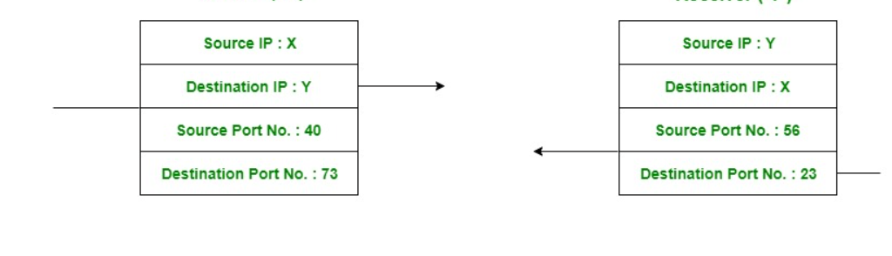

### The 4-tuple
A connection is uniquely identified by four values:

```
(source IP, source port, destination IP, destination port)
```

### Demultiplexing

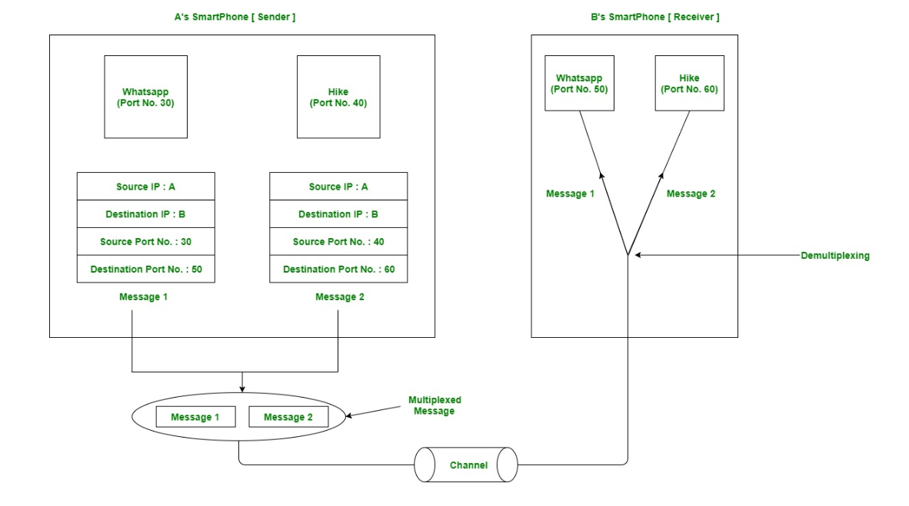

Demultiplexing is the process of **distributing arriving segments to the correct
sockets** based on that tuple.

### Multiplexing

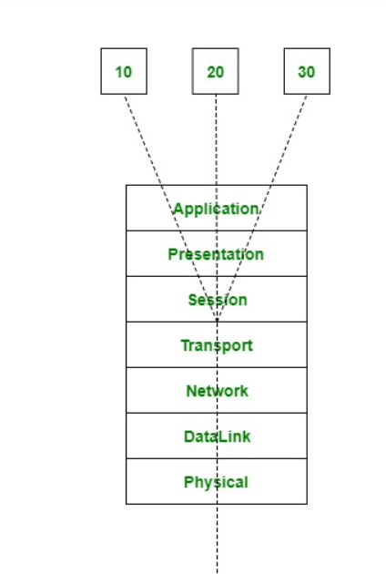

Multiplexing is **gathering data from multiple application processes of the sender,
enveloping that data with a header, and sending them as a whole** to the intended
receiver.

### What is a socket?

> Socket = **door + receptionist + mailbox**

- **Door** — the entry and exit point.
- **Receptionist** — decides where data goes, that is demultiplexing.
- **Mailbox** — buffers data.

More formally: a socket is an **OS endpoint for network communication**, holding
buffers, connection state, and IP/port metadata. It is a smart endpoint, not a simple
pipe.

### Source vs destination

| Field | Meaning |
| --- | --- |
| Source port | Port number of the sender's application |
| Destination port | Port number of the receiving service on the server |
| Source IP | IP address of the device sending the data |
| Destination IP | IP address of the device receiving the data |

## 2.5 TCP header

The **minimum TCP header is 20 bytes** without options. A **UDP header is 8 bytes**.
That difference is the price of reliability.

```
|          Source Port          |       Destination Port        |
|                        Sequence Number                        |
|                     Acknowledgment Number                     |
| Offset|Reserved|  Flags |            Window Size              |
|           Checksum            |        Urgent Pointer         |
|                    Options (0-40 bytes)                       |
```

Flags include SYN, ACK, FIN, RST, PSH, and URG.

## 2.6 TCP 3-Way Handshake

The 3-Way Handshake ensures both client and server are ready before data transmission
begins.

**Step 1 — SYN (Client → Server)**
- Client sends a TCP segment with `SYN=1`, including its **ISN (Initial Sequence
  Number)**.
- Marks the request to initiate a connection.

**Step 2 — SYN-ACK (Server → Client)**
- Server replies with `SYN=1` and `ACK=1`, containing its own ISN and
  `ACK = client_ISN + 1`.
- Confirms receipt of the client's SYN and initiates its own synchronisation.

**Step 3 — ACK (Client → Server)**
- Client sends `ACK=1` with `ACK = server_ISN + 1`.
- Completes synchronisation; the connection enters the **ESTABLISHED** state.

```
Client                                  Server
  |------------ SYN, seq=x ------------->|
  |<---- SYN-ACK, seq=y, ack=x+1 --------|
  |------------ ACK, ack=y+1 ----------->|
  |             ESTABLISHED              |
```

### On the ISN
The ISN is **not** for packets. It is the starting sequence number for the **TCP byte
stream**, and packets carry ranges of those byte numbers. A new connection knows where
the stream starts because the ISN is exchanged in the handshake before any data flows.

## 2.7 Connection termination — the 4-way close

- **FIN** — the client sends a FIN (finish) packet to the server to terminate the
  connection.
- **ACK** — the server acknowledges the FIN with an ACK.
- **FIN** — the server sends its own FIN to terminate its side.
- **ACK** — the client acknowledges the server's FIN.

Two independent directions are closed separately, which is exactly what "full duplex"
implies.

## 2.8 Protocols

### 1. TCP — Transmission Control Protocol
- **Connection-oriented.**
- **Reliable.**
- Because it is connection-oriented, the connection is established between the two ends
  first, then data is transferred, then the connection is terminated after all data has
  been sent.
- Provides ordering, retransmission, flow control, and congestion control.

### 2. UDP — User Datagram Protocol
- **Not reliable.**
- **Connectionless.**
- Used when speed and size matter more than security and dependability.
- Supplements higher-layer data with transport-level addresses, checksum error control,
  and length information.
- The packet UDP generates is called a **user datagram**.

### 3. SCTP — Stream Control Transmission Protocol
A transport-layer protocol like TCP and UDP, but more advanced and specialised.

In SCTP, **one connection can carry multiple independent streams at the same time**:

```
Connection → Stream 1 (data A)
           → Stream 2 (data B)
           → Stream 3 (data C)
```

Where it is used:

- **Telecom** — 4G/LTE/5G core networks, SS7 signalling replacement.
- **Financial systems** — high-reliability trading systems.
- **Industrial and control systems** — systems needing failover and redundancy.

### Comparison

| Protocol | Type | Key idea |
| --- | --- | --- |
| TCP | Byte stream | Reliable, single stream |
| UDP | Datagram | Fast, no guarantee |
| SCTP | Message-based | Multi-stream and multi-path |

## 2.9 QUIC

### Key idea
> QUIC = **one connection with many streams.**

### Details
**QUIC (Quick UDP Internet Connections)** is a modern transport protocol built on top of
**UDP**, designed to replace TCP + TLS for web communication.

Simple framing: QUIC is **TCP + TLS + HTTP/2 features, but built over UDP**.

### Why QUIC was created
TCP has problems:

- Slow handshake, because TCP and TLS are two separate handshakes.
- Head-of-line blocking.
- Hard to improve, because it is a kernel-level protocol.

QUIC fixes these at the **user space level**, so it can be updated by shipping a new
browser or library rather than a new operating system.

### Key features

1. **Faster connection setup** — combines transport and encryption handshake, usually
   1-RTT or even 0-RTT.
2. **Built-in encryption** — TLS 1.3 is integrated; every QUIC connection is encrypted
   by default.
3. **No head-of-line blocking** — multiple independent streams; if one stream loses a
   packet, the others continue.
4. **Runs on UDP** — UDP gives flexibility, and QUIC handles reliability itself.
5. **Connection migration** — you can change network, WiFi to mobile data, without
   dropping the connection.

### TCP vs QUIC

| Feature | TCP | QUIC |
| --- | --- | --- |
| Base | TCP | UDP |
| Encryption | Separate (TLS) | Built in |
| Streams | Single stream | Multiple streams |
| Head-of-line blocking | Yes | No |
| Connection speed | Slower | Faster |

### Where QUIC is used
- HTTP/3 runs on QUIC.
- YouTube, Google Search.
- Chrome and Chromium browsers.
- Cloud services from Google and Cloudflare.

> A **stream** is a logical sequence of data that can be sent and received independently
> within one connection.

## 2.10 Reference diagrams

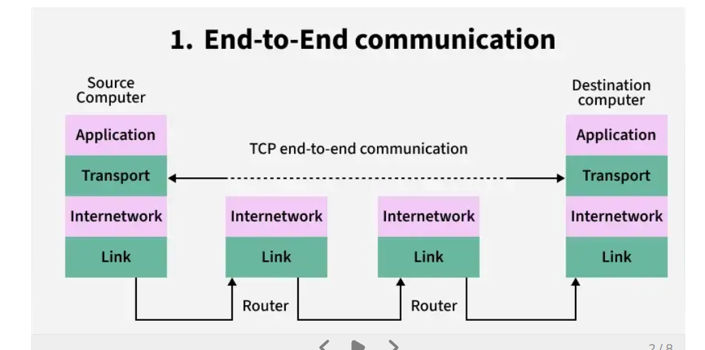
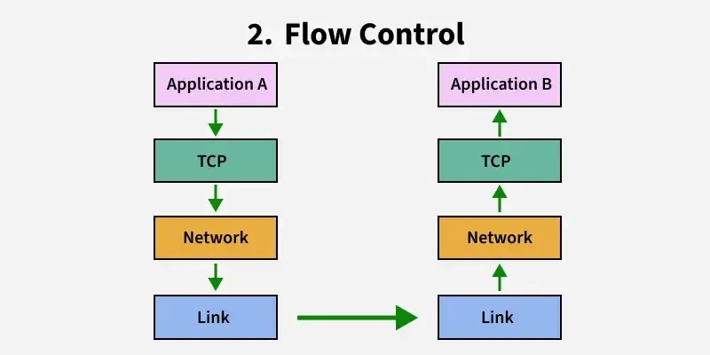
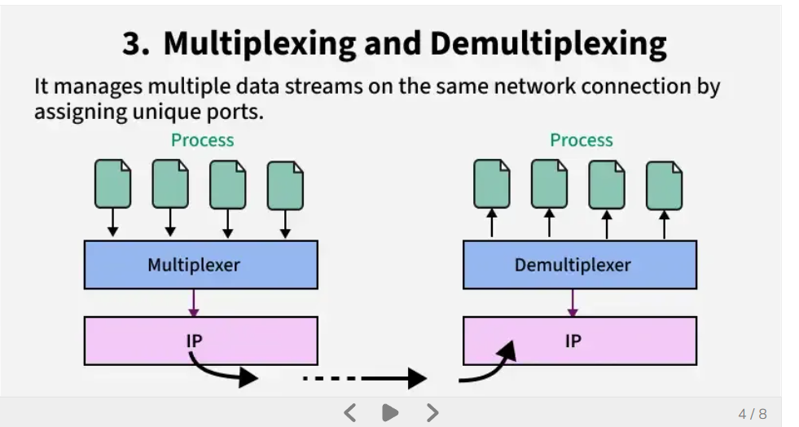
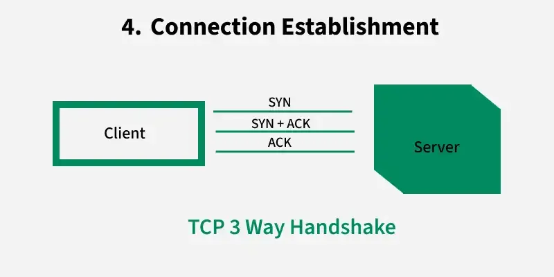
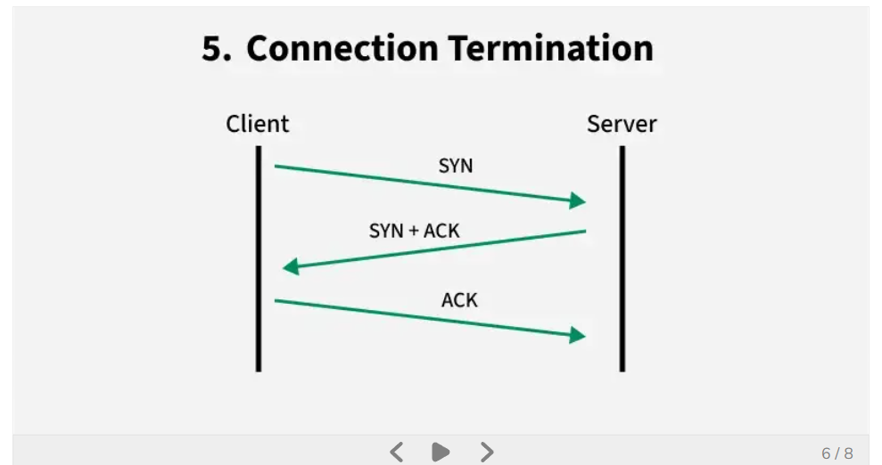
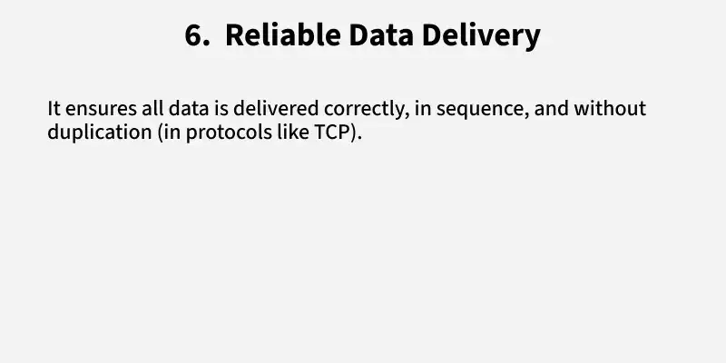
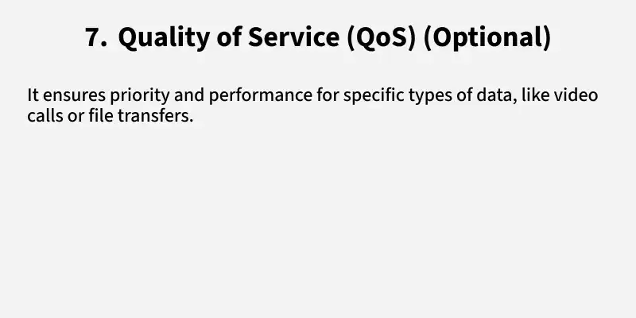

---

# 3. Q&A — Layers 3 & 4

### Network layer

**Will the Network layer convert segments into packets?**
Yes. It takes segments from the Transport layer, adds an IP header with source and
destination IP, and wraps them into packets.

**How will the Network layer choose the next router, based on what?**
The router device holds a routing table, and the next hop is selected from it by
matching the destination IP against the most specific prefix.

**So will there be a router in my laptop too?**
Yes. Your laptop has a routing table, a small set of rules that tells it where to send
network traffic. Local subnet traffic goes direct; everything else goes to the default
gateway.

**Do all network devices work together at once?**
No. They are used based on destination and network boundaries. Same LAN uses only the
switch; outside the LAN adds the router.

**Why 8 bits?**
2⁸ = 256 possible values, enough to represent characters, numbers, and symbols.

**What is the MTU?**
The amount of data one packet can carry, 1500 bytes on Ethernet.

**What does the Network layer NOT do?**
No retransmission, no reliability guarantee, no ordering, no connection management.

### Transport layer

**What is the size of the TCP header without options?**
Minimum TCP header is 20 bytes. A UDP header is 8 bytes.

**Is one TCP request one process?**
No. One process can handle many TCP connections.

**Does TCP use multiplexing and demultiplexing?**
Yes, to combine multiple application data streams and route them correctly.

**Can TCP handle only one instance at a time?**
No. TCP handles many simultaneous connections.

**How does the Transport layer know which socket gets the data?**
It uses the 4-tuple: source IP, source port, destination IP, destination port.

**Do segments store socket IDs?**
No. They store IP and port information, not socket IDs.

**What are the sequence number and ACK number for?**
They ensure ordering and reliability, not routing.

**What is a socket?**
An OS endpoint for network communication.

**What does a socket contain?**
Buffers, connection state, and IP/port metadata.

**Is a socket like a tube into an application?**
Not exactly. It is a smart endpoint, not a simple pipe.

**Do TCP segments store the 4-tuple?**
Not directly. The IP header and the TCP header together form the 4-tuple.

**How does demultiplexing work when the ports are the same?**
Source IP and source port differences make each connection unique.

**What if the same device sends multiple requests?**
The OS assigns different source ports, or reuses one connection.

**What if everything is identical, IP, ports, and sequence?**
That is impossible. TCP and the OS prevent duplicate connections.

**How does a server know which is the first segment in sequence on a new connection?**
Through the 3-way handshake, where the ISN is established before any data is exchanged,
marking the start of the byte stream.

**Application vs process?**
An application is a program stored on disk. When executed in memory it becomes a process
managed by the OS, and it may spawn multiple processes or threads while running.

---

# 4. Quick revision sheet

| Question | Layer 3 | Layer 4 |
| --- | --- | --- |
| Unit | Packet | Segment / datagram |
| Address | IP | Port |
| Scope | Hop by hop, host to host | End to end, process to process |
| Where it runs | Every router and host | End hosts only |
| Reliability | None | TCP yes, UDP no |
| Ordering | None | TCP yes |
| Key protocols | IP, ICMP, NAT, IPSec, MPLS | TCP, UDP, SCTP, QUIC |
| Routing protocols | RIP, OSPF, BGP | n/a |
| Devices | Router, L3 switch, gateway | none |

**One sentence each**

- Layer 3 gets a packet from any network to any other network, choosing one next hop at
  a time, and promises nothing about arrival.
- Layer 4 turns that unreliable hop-by-hop delivery into a conversation between two
  processes, adding ports, ordering, and retransmission.

---

**Previous:** [OSI Layers 1 & 2 — Physical & Data Link](../OSI_LAYERS_1-2_PHYSICAL_DATALINK/README.md)

**Next:** [OSI Layers 5, 6 & 7 — Session, Presentation & Application](../OSI_LAYERS_5-6-7_SESSION_PRESENTATION_APPLICATION/README.md)
