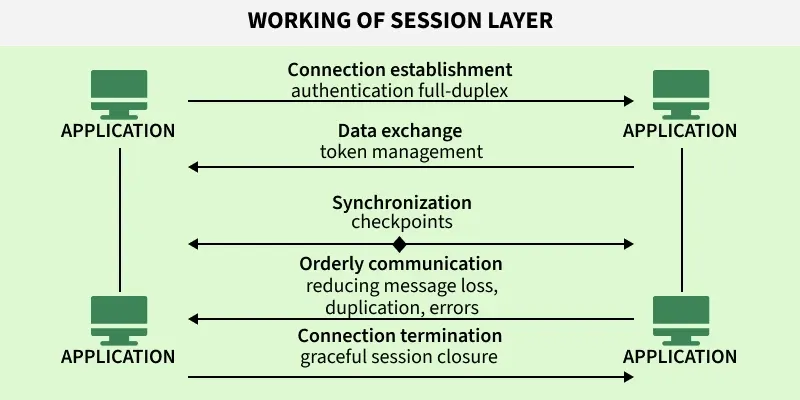

# OSI Layers 5, 6 & 7 — Session, Presentation & Application

> Scope: the three upper layers. How conversations are opened, kept in sync and closed;
> how data is translated, compressed and encrypted; and how applications actually speak
> to the network.
>
> Source: extracted and reorganised from `md/DOCUMENTATIONS ...md` → `SYSTEM_DESIGN vs BACKEND` →
> `PREVIOUS, OSI LAYERS, API DESIGN, Networking Essentials` → `OSI layers-(Open System Interconnection)`.

---

## 0. Where these layers sit

| # | Layer | Job in one line | Typical protocols |
| --- | --- | --- | --- |
| 7 | Application | Provides network services to user software | HTTP, DNS, SMTP, FTP, SSH |
| 6 | Presentation | Translates, compresses, encrypts data | TLS, SSL, XDR, NDR |
| 5 | Session | Opens, synchronises and closes conversations | RTCP, PPTP, RPC, SDP |

A practical caveat worth stating up front: in the real TCP/IP stack these three layers
are **collapsed into one application layer**. Many Layer 5 and Layer 6 functions are
absorbed by the Transport layer or by the application protocol itself. They remain
useful as **conceptual categories**, which is how they are taught and how they are asked
about in interviews.

---

# 1. Session Layer (Layer 5)

## 1.1 Overall

- Operates at Layer 5 of the OSI model.
- Manages session **setup, maintenance, and termination**.
- Controls **dialogue**: who sends and receives, and when.
- Provides **synchronisation and recovery** mechanisms.
- Many of its functions are integrated into the Transport or Application layers in
  modern TCP/IP networks.

## 1.2 Key functions

- **Session establishment** — initiates and negotiates communication parameters, such as
  authentication and duplex mode.
- **Communication synchronisation** — keeps data streams in order using checkpoints.
- **Activity and dialog management** — controls turns, prevents collisions, and avoids
  duplication.
- **Resynchronisation and recovery** — recovers from failures using synchronisation
  points.
- **Session termination** — gracefully ends communication after all data is exchanged.

## 1.3 Flow



1. Establishes and negotiates session parameters, for example authentication and duplex
   mode.
2. Manages **token-based dialogue control** to avoid collisions.
3. Inserts **synchronisation checkpoints** for recovery from failures.
4. Ensures data integrity by reducing duplication or message loss.
5. Gracefully terminates the session after confirming all data has been exchanged.

### Why checkpoints matter
If a 1 GB transfer fails at 900 MB, a session with checkpoints resumes from the last
checkpoint rather than restarting. This is the conceptual ancestor of HTTP range
requests and resumable uploads.

## 1.4 Protocols

### ADSP — AppleTalk Data Stream Protocol
Developed by Apple for LAN communication with self-configuration support.

- Provides a **reliable, ordered byte-stream connection** between devices on an AppleTalk
  network.
- Uses **connection-oriented communication** similar to TCP.
- Handles **error detection, retransmission, and flow control** automatically.
- Supports **self-configuring** network communication within Apple's AppleTalk suite.
- Was mainly used for Mac-to-Mac or printer and file sharing in old Apple LANs.

**Is it only for the Apple ecosystem?** Yes.

- ADSP is only for Apple's old AppleTalk ecosystem.
- Designed for Mac computers, printers, and devices in Apple LAN networks.
- Not used on the modern internet or on non-Apple systems.
- Today it is **obsolete**, replaced by TCP/IP protocols such as HTTP, TCP, and QUIC.
- Practically, it existed only in legacy Apple network environments.

### RTCP — Real-time Transport Control Protocol
Provides QoS feedback for RTP-based multimedia sessions.

- Works with **RTP (Real-time Transport Protocol)** to transmit media data like voice and
  video.
- Provides **feedback about network quality**: packet loss, delay, jitter.
- Helps adjust **Quality of Service** during streaming.
- Does **not carry media itself**, only control and monitoring data.
- Commonly used in VoIP, video calls, and live streaming systems.

**How RTCP is implemented**

- RTP carries the **audio and video data**.
- RTCP carries the **control and feedback data**.
- Both run over **UDP ports**, conventionally:

```
RTP  → even UDP port
RTCP → next odd UDP port
```

Example:

```
RTP:  5004
RTCP: 5005
```

### Other Layer 5 protocols

- **PPTP (Point-to-Point Tunnelling Protocol)** — enables VPNs over TCP/IP. Now
  considered cryptographically broken; use IPSec or WireGuard instead.
- **PAP (Password Authentication Protocol)** — password-based user authentication in PPP
  connections. Sends credentials in the clear, so CHAP or EAP is preferred.
- **RPCP (Remote Procedure Call Protocol)** — allows a program to execute procedures in
  another address space, the basis of client-server interaction. The modern descendant is
  gRPC.
- **SDP (Sockets Direct Protocol)** — supports socket communication over RDMA-enabled
  networks.

## 1.5 Devices

- **Firewalls** — monitor and control sessions for security.
- **Proxy servers** — act as intermediaries, managing sessions between clients and
  servers.
- **Session Border Controllers (SBCs)** — secure and manage VoIP sessions.
- **Application servers** — create and maintain user sessions for applications.

## 1.6 Where Layer 5 shows up in backend work

Even though the OSI session layer is not implemented as a separate layer in TCP/IP, the
**idea** is everywhere in backend systems:

| Concept | Modern equivalent |
| --- | --- |
| Session establishment | Login, JWT issuance, OAuth token grant |
| Session state | Cookies, server-side session stores, Redis session cache |
| Dialogue control | Request/response vs WebSocket full-duplex messaging |
| Checkpoints | Resumable uploads, HTTP range requests, Kafka consumer offsets |
| Graceful termination | Connection draining, `SIGTERM` handling before shutdown |

---

# 2. Presentation Layer (Layer 6)

## 2.1 Overview

The Presentation Layer is the 6th layer of the OSI model, responsible for ensuring that
data is properly **formatted, translated, encrypted, and compressed** so different
systems can understand each other.

It acts as a **translator between the Application Layer and the lower layers** of the
network stack.

## 2.2 Key responsibilities

- Ensures **data compatibility between different systems**.
- Handles **data formatting and structure**, both syntax and semantics.
- Provides **encryption and decryption**.
- Applies **data compression**.
- Acts as a **data translation layer**.

## 2.3 Role in the OSI model

**Sender side**
- Converts application data into a standard transferable format.
- Encrypts and compresses data.
- Passes data to the Session layer.

**Receiver side**
- Decrypts data.
- Decompresses data.
- Converts it back into an application-readable format.

## 2.4 Functions

### 1. Data translation
Converts data formats between systems, for example ASCII ↔ Unicode, JSON ↔ XML.

### 2. Data compression
Reduces data size to save bandwidth and improve transmission speed.

### 3. Encryption and decryption
Encrypts data for security before transmission, decrypts it after reception.

### 4. Syntax and semantics management
Ensures the data structure (syntax) is correct and the meaning (semantics) is preserved.

### 5. Transfer syntax negotiation
Agrees on the encoding type, compression method, and data representation format.

### 6. Interoperability
Enables communication between different operating systems, different architectures, and
different data formats.

## 2.5 Services provided

- Encryption and decryption
- Compression
- Format translation
- Cross-platform compatibility

## 2.6 Working of the Presentation layer

**Sender side** — Application Layer → Presentation Layer:
1. Format data
2. Compress data
3. Encrypt data
4. Pass to Session Layer

**Receiver side** — Session Layer → Presentation Layer:
1. Decrypt data
2. Decompress data
3. Convert to readable format
4. Pass to Application Layer

Note the ordering. On the way out you **compress then encrypt**; on the way in you
**decrypt then decompress**. Compressing after encryption is useless, because ciphertext
has no redundancy left to squeeze out.

## 2.7 Protocols

- **SSL (Secure Socket Layer)** — legacy secure communication. Deprecated; all versions
  are broken.
- **TLS (Transport Layer Security)** — modern secure protocol. TLS 1.3 is current.
- **XDR (External Data Representation)** — data encoding standard.
- **NDR (Network Data Representation)** — data representation format.
- **AFP (Apple Filing Protocol)** — file services for macOS.
- **NCP (NetWare Core Protocol)** — file and print services for Novell systems.
- **LPP (Lightweight Presentation Protocol)** — ISO presentation services over TCP/IP.

### A note on where TLS really sits
TLS is classified here because it does encryption and format negotiation. In the TCP/IP
model it runs directly on top of TCP and below the application protocol, which is why
it is sometimes called a Layer 5, 6, or "Layer 6.5" protocol depending on the textbook.
The classification matters less than the mechanism.

## 2.8 Attacks on the Presentation layer

### Man-in-the-Middle (MITM)
Intercepts communication to steal or modify data.

### SSL/TLS downgrade attack
Forces weaker encryption protocols to break security. Mitigated by HSTS and by TLS 1.3
removing legacy cipher suites entirely.

### Certificate spoofing
Uses fake certificates to impersonate trusted servers. Mitigated by certificate pinning
and Certificate Transparency logs.

### Code injection
Exploits parsing and formatting vulnerabilities in data handling. Deserialisation bugs
in JSON, XML, and binary formats are the modern form of this.

## 2.9 Key ideas

> The Presentation Layer ensures data is in a format both sender and receiver can
> understand securely and efficiently.

**One-line summary:** the Presentation Layer is responsible for translating, encrypting,
and compressing data so that different systems can communicate correctly and securely.

---

# 3. Application Layer (Layer 7)

## 3.1 Overview

The Application Layer is the **topmost layer** of the OSI model, and it interacts
directly with **end-user applications**. It provides network services to software such
as browsers, email clients, file transfer tools, and remote login systems.

## 3.2 Key role

- Acts as the **interface between user applications and the network**.
- Provides **network services to applications**.
- Enables **communication between software and remote systems**.
- Handles **user-level network interactions**.

## 3.3 Important clarification — a common confusion

> **Application Layer ≠ the applications themselves.**

It provides **services for** applications, not the apps themselves.

Example:
- Chrome = the application.
- HTTP = the Application Layer protocol that Chrome uses.

## 3.4 Core functions

### 1. Data representation
Converts user data into network format and received data into readable format.
Example: HTML, JSON, XML formatting.

### 2. Network service access
Provides direct access to network services.
Example: email through Gmail or Outlook, file downloads over FTP or HTTP.

### 3. Application protocol handling
Defines rules for communication between applications.
Example: HTTP for web browsing, SMTP for email sending, DNS for name resolution.

### 4. Session management (logical concept here)
Maintains communication sessions, starts and ends application-level interactions.
Example: a login session on a website, an SSH connection session.

### 5. Resource sharing
Enables sharing of files, printers, and services.

## 3.5 How it works step by step

**Sender side**
1. User requests an action, for example opening a website.
2. The Application Layer formats the request.
3. Sends it to the lower layers: Presentation → Session → Transport.

**Receiver side**
1. Data arrives from the network.
2. The Application Layer processes it.
3. Converts it into readable output for the user.

## 3.6 Services provided

- File transfer
- Email communication
- Web browsing
- Remote login
- Name resolution
- Network resource sharing

## 3.7 Key protocols

### Web and communication
- **HTTP / HTTPS** — web browsing.
- **WebSocket** — real-time, full-duplex communication.

### Email
- **SMTP** — send emails.
- **IMAP / POP3** — receive emails.

### Name resolution
- **DNS** — converts a domain name to an IP address.

### File transfer
- **FTP** — file transfer.
- **SFTP** — secure file transfer.
- **NFS** — network file system access.

### Network management
- **SNMP** — device monitoring and management.

### System services
- **DHCP** — assigns IP addresses automatically.
- **TELNET** — remote login. Insecure and outdated.
- **SSH** — secure remote login.

## 3.8 Modern additions

### 1. HTTP/3 uses QUIC
The modern web stack is **HTTP/3 → QUIC → UDP**, replacing HTTP/2 → TLS → TCP. See the
QUIC section in the Layer 3 & 4 document for why.

### 2. The Application Layer handles logic, not transport
It decides **what** to send, **when** to send, and **how to interpret** the data. It does
not decide how the data physically moves.

### 3. It runs on top of everything

```
Application
    ↓
Presentation
    ↓
Session
    ↓
Transport
    ↓
Network
    ↓
Data Link
    ↓
Physical
```

## 3.9 Security considerations

Common attacks at this layer:

- MITM (Man-in-the-Middle)
- DNS spoofing
- Session hijacking
- Credential theft

Add to those the ones that dominate real backend incident reports: injection (SQL,
command, template), broken access control, and application-layer denial of service such
as HTTP floods and slowloris.

## 3.10 Key ideas

> The Application Layer is where **network meaning is created**. It defines what the data
> means, not how it moves.

**One-line summary:** the Application Layer provides network services directly to user
applications and defines protocols for communication like HTTP, DNS, SMTP, and FTP.

---

# 4. REST vs RESTful API

Included here because it is the Layer 7 design vocabulary you will actually be asked
about.

## 4.1 The difference

- **REST** is an **architectural style**, a set of rules and constraints for designing
  APIs and web services.
- **RESTful API** is an **actual API** built following REST principles.

In short: **REST = concept and rules. RESTful API = implementation of those rules in
real systems.**

## 4.2 Definitions

- **REST (Representational State Transfer)** is an architectural style for designing
  networked applications where resources are accessed using standard HTTP methods.
- A **RESTful API** is an API that follows REST principles such as stateless
  communication, resource-based URLs, and standard methods: GET, POST, PUT, DELETE.
- It is widely used in web services because it is **simple, scalable, and works over
  HTTP**.

## 4.3 Sample usage

A real working API built using REST rules.

**GitHub API**
```
GET https://api.github.com/users
GET https://api.github.com/users/octocat
```

**E-commerce API**
```
GET    /products
POST   /products
PUT    /products/10
DELETE /products/10
```

## 4.4 Takeaway

- REST = rules and design style.
- RESTful API = a real API built using those rules.

---

# 5. Quick revision sheet

| Question | Layer 5 | Layer 6 | Layer 7 |
| --- | --- | --- | --- |
| Job | Manage conversations | Translate and secure | Serve applications |
| Key verbs | Establish, sync, terminate | Encode, compress, encrypt | Request, respond, interpret |
| Protocols | RTCP, PPTP, RPC, SDP, PAP | TLS, SSL, XDR, NDR, AFP | HTTP, DNS, SMTP, FTP, SSH |
| Devices | Firewall, proxy, SBC, app server | none specific | none specific |
| Attacks | Session hijacking | MITM, TLS downgrade, cert spoofing | DNS spoofing, injection, credential theft |
| In TCP/IP | Folded into the application layer | Folded into the application layer | The application layer |

**One sentence each**

- Layer 5 decides when a conversation starts, whose turn it is, and when it ends.
- Layer 6 makes sure both sides read the bytes the same way, and that nobody else can.
- Layer 7 gives the bytes meaning, and is the only layer a user ever sees.

---

**Previous:** [OSI Layers 3 & 4 — Network & Transport](../OSI_LAYERS_3-4_NETWORK_TRANSPORT/README.md)

**Start:** [OSI Layers 1 & 2 — Physical & Data Link](../OSI_LAYERS_1-2_PHYSICAL_DATALINK/README.md)
