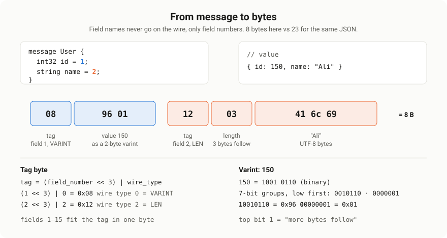
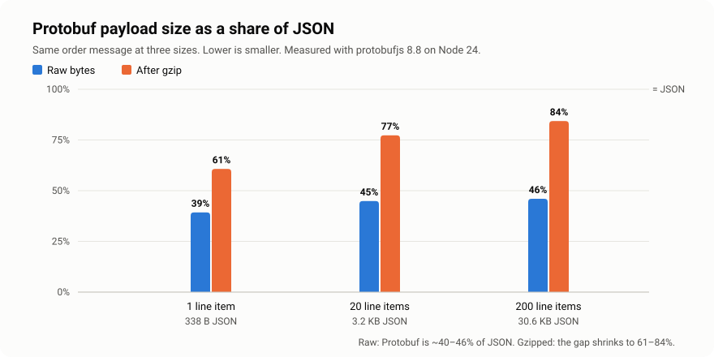
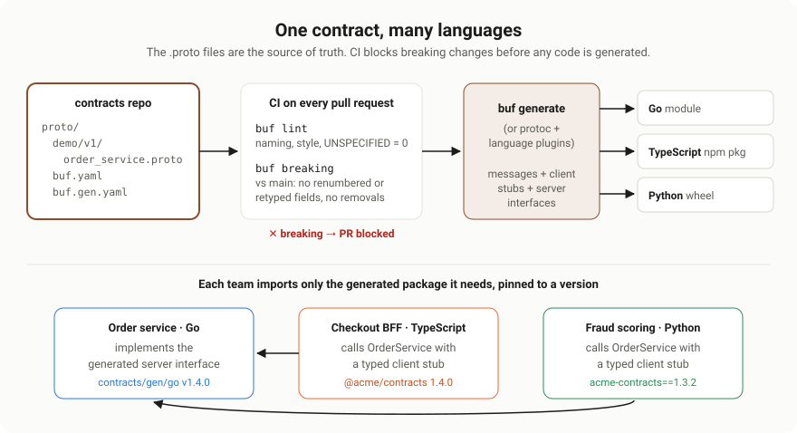
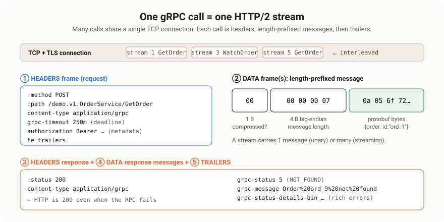

# Protocol Buffers & gRPC Deep Dive

> Scope: how to define `.proto` schemas well, what Protobuf's binary encoding actually does to
> your data, how fast and small it really is (measured, not assumed), how schemas evolve without
> breaking anyone, and how one contract generates typed code for every microservice.
>
> Source: extracted and reorganised from `0. md/DOCUMENTATIONS ...md` (and its HTML twin) →
> `API DESIGN > API TYPES`, `GRAPHQL, gRPC… > gRPC` (Overal, Docs, FAANG questions, Custom QA, Q&A),
> `Protocol Buffers and Type Safety`, and `Handling Failures and Fault Mode > gRPC`. Gaps were
> filled from protobuf.dev, grpc.io and the gRPC proposals. Every byte sequence, benchmark and
> compatibility claim marked **measured** or **tested** was run with protobufjs 8.8.0 and
> @grpc/grpc-js 1.14.4 on Node 24. All diagrams in `images/` were drawn for this document.

---

## 0. What this document covers

| Topic | One-line summary |
| --- | --- |
| What they are | Protobuf is a schema + binary format; gRPC is an RPC framework built on it and HTTP/2 |
| Defining schemas | Messages, types, enums, oneof, maps, presence, well-known types, services, style |
| Wire format | Tags, varints, zigzag, length-delimited fields: byte by byte |
| Speed and size | Measured against JSON: always smaller, faster to decode, not always faster to encode |
| Schema evolution | Which changes are safe, which corrupt data silently, and how `reserved` protects you |
| Type safety | What generated code guarantees, and what still needs validation |
| Code generation | `protoc`, Buf, static vs dynamic loading, contract repos, CI gates, publishing |
| gRPC on the wire | One call = one HTTP/2 stream: headers, length-prefixed messages, trailers |
| Choosing | gRPC vs REST vs GraphQL, and when not to use gRPC |

The practical companion to this document, covering the four streaming types, deadlines,
interceptors and error handling with a runnable service, is
[gRPC Practical Patterns & Streaming](../8.%20GRPC_PRACTICAL_PATTERNS_STREAMING/README.md).

---

# 1. What Protobuf and gRPC are

## 1.1 Protocol Buffers

**Protocol Buffers (Protobuf)** is a language-neutral, platform-neutral way to define structured
data once and serialise it to a compact binary format. Google created it for internal use and
open-sourced it in 2008.

The idea in one line: **define your data once in a `.proto` file, generate strongly typed code for
every language, and serialise efficiently.**

It has three parts:

1. **A schema language**, the `.proto` file.
2. **A compiler**, `protoc`, plus per-language plugins that generate code.
3. **A binary wire format** that the generated code reads and writes.

## 1.2 gRPC

**gRPC** is a high-performance Remote Procedure Call framework. A service calls a method on
another machine as if it were a local function:

```text
REST:  GET /users/1
gRPC:  userService.GetUser({ id: 1 })
```

It looks like a function call, but it runs over the network. gRPC combines two technologies:

- **Protocol Buffers** define the service contract and encode every message.
- **HTTP/2** carries the calls: many concurrent calls multiplexed over one long-lived connection,
  with compressed headers and native streaming.

Google open-sourced gRPC in 2015 as the successor to its internal RPC system, Stubby. It is now a
Cloud Native Computing Foundation project.

> **On the name.** The notes expand gRPC as "Google Remote Procedure Call". The project's official
> position is that the "g" stands for something different in every release, from "good" to
> "gravity", and the first release used the recursive "gRPC Remote Procedure Calls". In practice
> everyone understands the Google origin; just don't state the expansion as fact in an interview.

## 1.3 How the pieces fit

1. **Define** the service and messages in a `.proto` file.
2. **Generate** client stubs and server interfaces for each language.
3. **Implement** the server interface with your business logic.
4. **Call** the server through the generated client, which serialises the request, sends it over
   HTTP/2, and deserialises the response.

```proto
syntax = "proto3";

service UserService {
  rpc GetUser(GetUserRequest) returns (User);
}

message GetUserRequest {
  int32 id = 1;
}

message User {
  string name = 1;
  int32 age = 2;
}
```

## 1.4 Vocabulary

| Term | Meaning |
| --- | --- |
| Message | A typed data structure, like a class or DTO |
| Field number | The permanent numeric ID of a field; this, not the name, goes on the wire |
| Service | A named group of RPC methods |
| RPC method | A remotely callable function with a request and response type |
| Stub | Generated client code used to call a service |
| Channel | A client's managed connection to a server address, reused across calls |
| Metadata | Key-value pairs sent with a call, like HTTP headers |
| Deadline | The absolute time by which a call must finish |
| Status | The result of a call: a code such as `OK` or `NOT_FOUND` plus a message |
| Interceptor | Middleware that wraps calls on the client or server |

---

# 2. Defining `.proto` schemas

## 2.1 Anatomy of a file

```proto
syntax = "proto3";                          // or: edition = "2024";

package shop.orders.v1;                     // namespace + major version

import "google/protobuf/timestamp.proto";   // well-known types
import "shop/common/v1/money.proto";        // your own shared messages

option go_package = "github.com/acme/contracts/gen/go/shop/orders/v1;ordersv1";
option java_multiple_files = true;
option java_package = "com.acme.shop.orders.v1";

service OrderService { ... }
message Order { ... }
enum OrderStatus { ... }
```

- **`syntax` or `edition`** comes first and sets default behaviour for the file.
- **`package`** prevents name clashes and should end in a major version such as `v1`.
- **`import`** pulls in messages from other files.
- **`option`** lines control how code is generated for specific languages.

## 2.2 Scalar types

| Proto type | Encoding | JS type in `@grpc/proto-loader` | Use it for |
| --- | --- | --- | --- |
| `double`, `float` | Fixed 8 or 4 bytes | number | Real measurements. Never money |
| `int32`, `int64` | Varint | number, or string for int64 with `longs: String` | Non-negative or rarely negative integers |
| `uint32`, `uint64` | Varint | number, or string | Counts and sizes that are never negative |
| `sint32`, `sint64` | ZigZag varint | number, or string | Integers that are often negative |
| `fixed32`, `fixed64` | Fixed 4 or 8 bytes | number, or string | Values usually larger than 2^28, such as hashes |
| `sfixed32`, `sfixed64` | Fixed 4 or 8 bytes | number, or string | Large signed values |
| `bool` | Varint | boolean | Flags |
| `string` | Length-delimited UTF-8 | string | Text. Must be valid UTF-8 |
| `bytes` | Length-delimited | Buffer | Binary data, hashes, encrypted blobs |

Two rules that prevent real bugs:

- **Negative numbers in `int32` or `int64` always take 10 bytes.** Measured: an `int32` field set to
  −1 encodes to 11 bytes including its tag; the same value in `sint32` encodes to 2 bytes. Use
  `sint*` for fields that are often negative.
- **`int64` does not fit in a JavaScript number.** Values above 2^53 lose precision. Load with
  `longs: String` and convert with `BigInt` when you do arithmetic.

## 2.3 Messages, nesting, repeated and maps

```proto
message Order {
  string order_id = 1;
  OrderStatus status = 2;
  repeated LineItem items = 3;            // ordered list
  map<string, string> labels = 4;         // key-value map
  google.protobuf.Timestamp created_at = 5;

  message LineItem {                      // nested type: Order.LineItem
    string sku = 1;
    int32 quantity = 2;
    Money unit_price = 3;
  }
}

message Money {
  string currency_code = 1;               // ISO 4217, e.g. "USD"
  int64 units = 2;                        // whole units
  int32 nanos = 3;                        // fractional part, 10^-9 units
}
```

- **`repeated`** is an ordered list. Scalar numeric repeated fields are **packed** by default in
  proto3, which stores them as one length-delimited block.
- **`map<K, V>`** keys must be integer or string types. Iteration order is not guaranteed, and a map
  cannot be `repeated`.
- **Nested messages** are good for types that only make sense inside the parent. Promote them to top
  level once another message needs them.
- **Money** should never be a `double`. Use integer units, as in `Money` above, which mirrors
  Google's `google.type.Money`.

## 2.4 Enums

```proto
enum OrderStatus {
  ORDER_STATUS_UNSPECIFIED = 0;   // required first value, means "not set"
  ORDER_STATUS_PENDING = 1;
  ORDER_STATUS_PAID = 2;
  ORDER_STATUS_SHIPPED = 3;
  reserved 4;                     // was ORDER_STATUS_ON_HOLD, removed
  reserved "ORDER_STATUS_ON_HOLD";
}
```

- **The first value must be zero, and it should mean "unspecified".** An unset field reads as 0, so
  if 0 meant `USER` as in the notes' `Role` example, every message that forgot to set the role would
  silently become a normal user.
- **Prefix every value with the enum name** in `UPPER_SNAKE_CASE`. Enum values share a namespace
  with their siblings in the package, so two enums both containing `ACTIVE` would collide.
- **Proto3 enums are open.** Tested: an old reader receiving a value it doesn't know, such as 2,
  keeps the raw number 2 instead of failing. Code must handle unknown values.

## 2.5 oneof

A `oneof` holds at most one of its fields at a time. Setting one clears the others.

```proto
message ContactMethod {
  oneof method {
    string email = 1;
    string phone = 2;
    PushToken push = 3;
  }
}
```

Use it for "exactly one of these" data. Generated code exposes which field is set, for example
`message.method === "phone"` with proto-loader's `oneofs: true`. A `oneof` cannot contain
`repeated` or `map` fields.

## 2.6 Field presence: zero vs unset

This is the most misunderstood part of proto3.

| Declaration | Presence | Can you tell "unset" from zero? | Wire behaviour, measured |
| --- | --- | --- | --- |
| `int32 count = 1;` | Implicit | No | Value 0 is not written at all: 0 bytes |
| `optional int32 count = 1;` | Explicit | Yes, `hasCount()` or own-property check | Value 0 is written: 2 bytes |
| `Message field = 1;` | Explicit | Yes | Written if set |
| `repeated`, `map` | None | Empty equals unset | Nothing written when empty |

The notes' comment `string name = 1; // optional (proto3 default)` is misleading. Every proto3 field
can be absent, but a plain scalar field **cannot tell you whether it was absent**. A decoded `name` is
simply `""`. Add the `optional` keyword whenever "not provided" and "empty or zero" must mean
different things, which is essential for partial updates.

## 2.7 Well-known types

Google ships common messages in `google/protobuf/*`. Use them instead of inventing your own.

| Type | Represents | Why use it |
| --- | --- | --- |
| `Timestamp` | A point in time: seconds + nanos since the Unix epoch, UTC | Unambiguous; maps to native date types; JSON as RFC 3339 |
| `Duration` | A signed span of time | Timeouts, TTLs; JSON as `"1.5s"` |
| `FieldMask` | A list of field paths | Partial updates and partial reads: `update_mask: "email,address.city"` |
| `Empty` | No data | Request or response with nothing in it |
| `Any` | Any message plus its type URL | Extensible payloads such as error details |
| `Struct`, `Value` | Arbitrary JSON-like data | Genuinely schemaless blobs, sparingly |
| `StringValue`, `Int32Value`, … | Nullable scalars | Legacy presence workaround; prefer `optional` now |

## 2.8 Services and RPC methods

```proto
service OrderService {
  rpc GetOrder(GetOrderRequest) returns (Order);                       // unary
  rpc WatchOrder(WatchOrderRequest) returns (stream OrderEvent);       // server streaming
  rpc UploadItems(stream LineItem) returns (UploadSummary);            // client streaming
  rpc Chat(stream ChatMessage) returns (stream ChatMessage);           // bidirectional
}
```

The `stream` keyword on either side selects the call type. The practical patterns for each are in
the companion document.

## 2.9 Design and style rules

- **Give every RPC its own request and response message**, even if it has one field today.
  `rpc GetOrder(GetOrderRequest) returns (Order)` can grow new request fields without a breaking
  change; `rpc GetOrder(google.protobuf.StringValue)` cannot.
- **Version packages, not fields.** `package shop.orders.v1;` and later `shop.orders.v2`, served side
  by side during migration.
- **Naming:** `PascalCase` for messages, services and RPCs; `lower_snake_case` for fields; files in
  `lower_snake_case.proto`; enum values in `UPPER_SNAKE_CASE` prefixed with the enum name.
- **Reserve numbers 1 to 15 for the most frequent fields.** Their tags take one byte; 16 to 2047
  take two.
- **Pluralise repeated fields:** `repeated LineItem items`.
- **Use standard method names** where they fit: `Get`, `List`, `Create`, `Update`, `Delete`, as
  described in Google's API design guide.
- **Paginate `List` methods** with `page_size` and an opaque `page_token`, returning
  `next_page_token`.
- **Comment every field**; comments flow into generated code and documentation.

## 2.10 Editions: the successor to proto2 and proto3

Protobuf **Editions** replace the `syntax = "proto2"` and `syntax = "proto3"` split with a yearly
edition and per-feature switches. Edition 2023 unified proto2 and proto3 behaviour; **edition 2024
is the latest released edition**.

```proto
edition = "2024";

package shop.orders.v1;

message Order {
  string order_id = 1;
  int32 retry_count = 2 [features.field_presence = IMPLICIT];   // opt back into proto3 behaviour
}
```

The biggest default change: **editions use explicit presence for every field**, the equivalent of
writing `optional` everywhere in proto3. Proto3 files remain fully supported and can import and be
imported by edition files, so there is no need to migrate existing contracts in a hurry.

## 2.11 Complete example

This is the contract used by the runnable service in the companion document, where every RPC in it
is tested:

`order_service.proto`

```proto
syntax = "proto3";

package demo.v1;

import "google/protobuf/timestamp.proto";

// The four RPC shapes, on one realistic service.
service OrderService {
  // Unary: one request, one response.
  rpc GetOrder(GetOrderRequest) returns (Order);

  // Server streaming: one request, a stream of status updates.
  rpc WatchOrder(WatchOrderRequest) returns (stream OrderEvent);

  // Client streaming: the client uploads many line items, gets one summary.
  rpc UploadItems(stream LineItem) returns (UploadSummary);

  // Bidirectional streaming: live support chat about an order.
  rpc Chat(stream ChatMessage) returns (stream ChatMessage);
}

// A downstream dependency, used to show deadline propagation.
service InventoryService {
  rpc CheckStock(CheckStockRequest) returns (CheckStockResponse);
}

enum OrderStatus {
  ORDER_STATUS_UNSPECIFIED = 0;
  ORDER_STATUS_PENDING = 1;
  ORDER_STATUS_PAID = 2;
  ORDER_STATUS_SHIPPED = 3;
  ORDER_STATUS_DELIVERED = 4;
}

message GetOrderRequest {
  string order_id = 1;
}

message Order {
  string order_id = 1;
  OrderStatus status = 2;
  repeated LineItem items = 3;
  int64 total_cents = 4;
  bool in_stock = 5;
}

message WatchOrderRequest {
  string order_id = 1;
}

message OrderEvent {
  string order_id = 1;
  OrderStatus status = 2;
  google.protobuf.Timestamp at = 3;
}

message LineItem {
  string sku = 1;
  int32 quantity = 2;
  int64 unit_price_cents = 3;
}

message UploadSummary {
  int32 item_count = 1;
  int64 total_cents = 2;
}

message ChatMessage {
  string from = 1;
  string text = 2;
}

message CheckStockRequest {
  repeated string skus = 1;
}

message CheckStockResponse {
  bool all_in_stock = 1;
}
```

---

# 3. Binary serialisation: the wire format



## 3.1 The core idea

A Protobuf message on the wire is just a sequence of **key-value records**:

```text
[tag][value] [tag][value] [tag][value] ...
```

There is no schema, no field names, no delimiters and no message length inside the bytes. The
reader must already know the `.proto` to interpret them. This is exactly why the encoding is compact,
and why it is unreadable without the schema.

## 3.2 Tags and wire types

Every record starts with a **tag**, a varint combining the field number and a 3-bit wire type:

```text
tag = (field_number << 3) | wire_type
```

| Wire type | ID | Used for |
| --- | --- | --- |
| VARINT | 0 | `int32`, `int64`, `uint32`, `uint64`, `sint32`, `sint64`, `bool`, `enum` |
| I64 | 1 | `fixed64`, `sfixed64`, `double` |
| LEN | 2 | `string`, `bytes`, embedded messages, packed repeated fields |
| SGROUP, EGROUP | 3, 4 | Deprecated proto2 groups |
| I32 | 5 | `fixed32`, `sfixed32`, `float` |

The wire type tells a reader **how many bytes to skip** for a field it doesn't recognise. That single
property is what makes forward compatibility possible.

## 3.3 Varints

A varint stores an integer in 7-bit groups, least significant group first. The top bit of each byte
is a continuation flag: 1 means another byte follows.

```text
150 in binary          = 1001 0110
split into 7-bit groups = 0000001 0010110
low group first         = 0010110 0000001
add continuation bits   = 1 0010110   0 0000001
bytes                   = 0x96        0x01
```

So small numbers are tiny: 0 to 127 take one byte, 128 to 16,383 take two.

## 3.4 ZigZag for negative numbers

Plain varints treat negative numbers as huge unsigned values, so −1 becomes ten bytes. `sint32` and
`sint64` first apply **ZigZag** encoding, which maps small negative and positive numbers to small
unsigned ones:

| Original | ZigZag |
| --- | --- |
| 0 | 0 |
| −1 | 1 |
| 1 | 2 |
| −2 | 3 |
| 2 | 4 |

## 3.5 Length-delimited fields

Strings, bytes, embedded messages and packed arrays use wire type 2: a tag, then a varint length,
then that many bytes.

## 3.6 Measured byte sequences

Every line below was produced by encoding with protobufjs and matches the examples in the official
encoding guide.

| Message and value | Bytes | Breakdown |
| --- | --- | --- |
| `int32 a = 1` set to 150 | `08 96 01` | tag field 1 VARINT, varint 150 |
| `string b = 2` set to "testing" | `12 07 74 65 73 74 69 6e 67` | tag field 2 LEN, length 7, UTF-8 |
| `Test1 c = 3` with `c.a = 150` | `1a 03 08 96 01` | tag field 3 LEN, length 3, the nested message |
| `repeated int32 nums = 4` set to 3, 270, 86447 | `22 06 03 8e 02 af a3 05` | one LEN record holding 3 varints: packed |
| `int32` set to −1 | `08 ff ff ff ff ff ff ff ff ff 01` | 11 bytes: negative varint is always 10 bytes |
| `sint32` set to −1 | `10 01` | 2 bytes: ZigZag maps −1 to 1 |
| implicit `int32` set to 0 | nothing | default values are not written at all |
| `optional int32` set to 0 | `10 00` | explicit presence writes the zero |
| `User{id:1, name:"Ali", email:"ali@mail.com"}` | 21 bytes | the same object as JSON is 44 bytes |

## 3.7 Rules that fall out of the format

- **Field numbers are permanent.** They are the only identity a field has on the wire.
- **Valid field numbers are 1 to 536,870,911**, except 19,000 to 19,999, which are reserved for the
  Protobuf implementation.
- **Numbers 1 to 15 cost one tag byte**, so spend them on frequently set fields.
- **Default values cost zero bytes**, which is why implicit-presence fields can't tell "unset" from
  zero.
- **Field order in the bytes doesn't matter**, and a repeated scalar field is last-one-wins when read
  as singular.
- **Serialisation is not canonical.** Map ordering and unknown-field placement can differ between
  languages and library versions. Never hash or sign serialised bytes and expect another service to
  reproduce them; the notes' "same input → same binary output" only holds within one binary using
  deterministic mode.

---

# 4. Speed and size, measured

The notes list "faster and smaller than JSON" as a headline benefit, and cite "30–70% latency
reduction". Size is reliably true. Speed depends heavily on the language and library, so it was
measured here rather than assumed.

## 4.1 Method

An `Order` message with an enum, a nested `Money`, a timestamp, tags and N line items was encoded as
JSON with `JSON.stringify` and as Protobuf with protobufjs, at 1, 20 and 200 line items. Throughput
was measured in operations per second after JIT warm-up, on Node 24 on an Apple M1, and the benchmark
was run twice.

## 4.2 Size



| Line items | JSON | Protobuf | Protobuf ÷ JSON | JSON gzipped | Protobuf gzipped | Protobuf ÷ JSON, gzipped |
| --- | --- | --- | --- | --- | --- | --- |
| 1 | 338 B | 133 B | 39% | 242 B | 147 B | 61% |
| 20 | 3,198 B | 1,435 B | 45% | 428 B | 331 B | 77% |
| 200 | 30,627 B | 14,076 B | 46% | 1,947 B | 1,642 B | 84% |

- **Raw Protobuf is less than half the size of JSON**, because field names, quotes, braces and
  decimal digits never go on the wire.
- **Compression narrows the gap sharply.** Repeated JSON field names compress extremely well, so a
  gzipped JSON payload of 200 items is only 19% bigger than gzipped Protobuf.
- **Tiny messages don't compress.** At 1 item, gzip made Protobuf *larger*, 133 to 147 bytes,
  because of gzip's header overhead.

## 4.3 Speed in JavaScript

Rounded operations per second; higher is faster.

| Line items | JSON encode | Protobuf encode | JSON decode | Protobuf decode |
| --- | --- | --- | --- | --- |
| 20 | ~175,000–234,000 | ~173,000–178,000 | ~112,000–128,000 | ~180,000–199,000 |
| 200 | ~27,000 | ~19,000–20,000 | ~14,000 | ~21,000 |

- **Decoding Protobuf was about 1.5 times faster** than `JSON.parse` for realistic messages.
- **Encoding was not faster.** For 200 items protobufjs encoded about 30% *slower* than V8's native,
  C++-implemented `JSON.stringify`.
- **A full round trip was roughly a tie** at 20 and 200 items.

**Conclusion:** in Node.js, Protobuf's win is **size and a typed contract**, not raw CPU. In
languages whose Protobuf libraries are compiled rather than written in JavaScript, such as Go, Java,
C++ and Rust, published benchmarks generally show larger serialisation speedups, but measure your own
payloads before quoting a number.

## 4.4 Where gRPC's real-world speed comes from

Serialisation is usually a small fraction of a request's latency. The larger gains come from the
transport:

- **Persistent connections.** One HTTP/2 connection is reused for thousands of calls, avoiding a TCP
  and TLS handshake per request.
- **Multiplexing.** Many concurrent calls share that connection without HTTP/1.1's
  one-request-at-a-time limit.
- **HPACK header compression.** Repeated headers such as `:path` and `authorization` shrink to a few
  bytes after the first call.
- **Smaller payloads.** Less data to send, which matters most on mobile and cross-region links.
- **Generated code.** No hand-written parsing or validation of shapes.

A latency figure like the notes' "30–70%" is plausible for chatty service-to-service traffic over
HTTP/1.1 without keep-alive, but it describes a specific workload, not a law. REST over HTTP/2 with
connection reuse closes much of that gap.

**One nuance on head-of-line blocking:** HTTP/2 removes HTTP-level head-of-line blocking, as the notes
say, but all streams still share one TCP connection, so a single lost packet stalls every stream
until it is retransmitted. HTTP/3 over QUIC removes that too.

---

# 5. Schema evolution and compatibility

Contracts change constantly. Protobuf is designed so that **old and new code can exchange messages**,
provided you follow a small set of rules.

- **Backward compatible:** new code can read data written by old code.
- **Forward compatible:** old code can read data written by new code.

## 5.1 What each change actually does (tested)

Each row was tested by encoding with one schema and decoding with the other in protobufjs.

| Change | Result | Verdict |
| --- | --- | --- |
| Add a new field with a new number | New reader sees default for missing field; old reader skips the unknown field | ✅ Safe |
| Remove a field and `reserved` its number and name | Old data with that number is skipped | ✅ Safe |
| Rename a field, same number | Binary unaffected: decoded as `user_id` / `full_name` | ⚠️ Binary safe, **breaks JSON** and generated code |
| `int32` to `int64`, same number | Decoded correctly: `id: "7"` | ✅ Safe (also `uint32`↔`uint64`, `bool`) |
| Add a value to an enum | Old reader keeps the raw number 2 | ✅ Safe if code handles unknown values |
| `repeated string` read as singular `string` | Old reader keeps the last element only: `"c"` | ⚠️ Lossy |
| Change type with a different wire type: `int32` to `string` | Field silently dropped: `{"name":"Ali"}` | ❌ Breaking, silent |
| Renumber a field: `name` from 2 to 5 | Name silently lost: `name: ""` | ❌ Breaking, silent |
| Reuse a deleted number for a new `string` field | Old `name` bytes decoded as `nickname: "Ali"` | ❌ **Silent data corruption** |

The dangerous rows don't throw. They produce valid-looking but wrong data, which is far worse than a
crash.

## 5.2 Always reserve deleted fields

```proto
message User {
  reserved 2, 15, 9 to 11;
  reserved "name", "legacy_score";

  int32 id = 1;
  string display_name = 3;
}
```

`reserved` makes the compiler reject any future attempt to reuse the number or name. Tested:
protobufjs refused a schema that reused a reserved number with `id 2 is reserved in Type User`.

The notes suggest keeping removed fields and marking them deprecated. That's a valid transitional
step, `string name = 2 [deprecated = true];`, but the end state is deletion plus `reserved`.

## 5.3 Unknown fields: a Node.js gotcha

When an old reader decodes a message containing fields it doesn't know, the official C++, Java, Go
and Python libraries **preserve** those unknown fields and write them back out if the message is
re-serialised. The notes' "ignored safely" undersells this; preservation is what lets a proxy on old
code pass new data through untouched.

**Tested:** protobufjs does **not** preserve them. A 22-byte message from a newer schema, decoded and
re-encoded by the older schema, came out as 7 bytes; the `email` and `roles` fields were gone.

**Consequence:** a Node.js service that decodes, modifies and re-encodes messages, such as a gateway,
enricher or queue consumer, **strips any fields added after it was deployed**. Either redeploy it with
the new schema first, or forward the original bytes instead of re-encoding.

## 5.4 Compatibility checklist

- ✅ Add fields with new numbers.
- ✅ Delete fields, then `reserved` the number and the name.
- ✅ Add enum values; handle unknown values in code.
- ✅ Add new RPC methods and new services.
- ❌ Never change a field's number.
- ❌ Never reuse a number or name, even years later.
- ❌ Never change a field's type unless the pair is listed as compatible.
- ❌ Never rename a field or enum value if anything uses the JSON mapping.
- ❌ Never rename a package, service or method. The method's full name, such as
  `/demo.v1.OrderService/GetOrder`, is the URL path clients call.
- ❌ Never move a field into or out of a `oneof`.
- ✅ For genuinely breaking redesigns, create a new package version such as `v2` and run both.

## 5.5 Deployment order

1. **Adding a field:** deploy readers first so nothing strips or ignores it, then writers.
2. **Removing a field:** stop writing it, deploy all writers, then stop reading it, then delete and
   reserve it.
3. **Enforce the rules in CI** with `buf breaking`, covered in section 7.

---

# 6. Type safety: what you get and what you don't

## 6.1 What Protobuf gives you

| Feature | JSON | Protobuf |
| --- | --- | --- |
| Schema | Optional (JSON Schema, OpenAPI) | Required |
| Types | Loose: numbers, strings, no int64 | Strict: 15 scalar types, enums, messages |
| Checked at | Runtime, if you add validation | Compile time in typed languages, plus runtime |
| Contract drift | Discovered in production | Caught when code is regenerated |
| Readability | Human-readable | Binary, needs the schema |

In statically typed languages such as Go, Java, C# and TypeScript with generated types, sending a
string where an `int32` is expected is a **compile error**.

## 6.2 The limits, tested in JavaScript

| Call | Result | Lesson |
| --- | --- | --- |
| `User.verify({ id: "abc" })` | `"id: integer expected"` | `verify` catches wrong types |
| `User.verify({ emial: "typo" })` | `null`, no error | Unknown and misspelled keys are not reported |
| `User.verify({ email: "" })` | `null`, no error | No business rules: nothing is required |
| `User.fromObject({ id: "abc" }).id` | `0` | Silent coercion |
| `User.fromObject({ id: 3000000000 }).id` | `-1294967296` | **Silent int32 overflow** |
| `User.encode({ id: "abc", name: 42 })` without `verify` | Decodes as `{}` | Bad input produces wrong data, not an error |

**Proto3 has no "required" fields**; they were removed deliberately because a required field can
never be safely removed. Business validation, such as "email is non-empty and looks like an email",
needs a separate layer:

- **protovalidate**, from Buf, puts rules in the schema and enforces them in each language:

```proto
import "buf/validate/validate.proto";

message CreateUserRequest {
  string email = 1 [(buf.validate.field).string.email = true];
  int32 age = 2 [(buf.validate.field).int32 = { gte: 13, lte: 150 }];
}
```

- Or validate explicitly in the handler and return `INVALID_ARGUMENT` with field details.

## 6.3 Mini project: Protobuf in Node.js

The notes' mini project, corrected to validate before encoding and to show presence and the limits of
`verify`:

`user.proto`

```proto
syntax = "proto3";

package demo.v1;

message User {
  int32 id = 1;
  string name = 2;
  string email = 3;
  repeated string roles = 4;
  optional string nickname = 5;   // explicit presence: "unset" differs from ""
}
```

`index.js`

```js
// index.js — define once, validate, encode, decode.
const protobuf = require("protobufjs");

async function run() {
  const root = await protobuf.load("user.proto");
  const User = root.lookupType("demo.v1.User");

  const payload = { id: 150, name: "Ali", email: "ali@mail.com", roles: ["admin"] };

  // 1. Validate BEFORE encoding. fromObject/encode coerce silently otherwise:
  //    "abc" -> 0 and 3_000_000_000 -> -1294967296 for an int32.
  const problem = User.verify(payload);
  if (problem) throw new Error(`Invalid User: ${problem}`);

  // 2. Encode to bytes.
  const bytes = User.encode(User.fromObject(payload)).finish();
  console.log("protobuf:", bytes.length, "bytes", Buffer.from(bytes).toString("hex"));
  console.log("json:    ", Buffer.byteLength(JSON.stringify(payload)), "bytes");

  // 3. Decode, then convert to a plain object with explicit options.
  const decoded = User.toObject(User.decode(bytes), { defaults: true });
  console.log("decoded: ", decoded);

  // 4. Presence: only `optional` fields can tell "unset" from "empty".
  const message = User.decode(bytes);
  console.log("has nickname?", Object.prototype.hasOwnProperty.call(message, "nickname"));

  // 5. verify() catches wrong types, not business rules or typos in field names.
  console.log(User.verify({ id: "150" }));        // "id: integer expected"
  console.log(User.verify({ emial: "typo" }));    // null  -> unknown keys are NOT reported
}

run().catch((err) => { console.error(err); process.exit(1); });
```

Actual output:

```text
protobuf: 29 bytes 0896011203416c691a0c616c69406d61696c2e636f6d220561646d696e
json:     64 bytes
decoded:  { roles: [ 'admin' ], id: 150, name: 'Ali', email: 'ali@mail.com' }
has nickname? false
id: integer expected
null
```

---

# 7. Code generation across microservices



## 7.1 What gets generated

From one `.proto`, each language plugin produces:

| Artifact | Contents | Used by |
| --- | --- | --- |
| Message types | Classes or structs with typed fields, builders, encode and decode | Everyone |
| Client stub | One method per RPC that serialises, sends and deserialises | Callers |
| Server interface or base class | One abstract method per RPC to implement | The service owner |
| Service descriptor | Method names, paths, streaming flags | The gRPC runtime, reflection, tools |

## 7.2 Static generation vs dynamic loading

| Approach | How | Pros | Cons |
| --- | --- | --- | --- |
| Static codegen | `protoc` or `buf generate` writes source files at build time | Full IDE types and autocompletion; compile-time errors; fastest | Build step; generated code to version |
| Dynamic loading | `@grpc/proto-loader` parses `.proto` at runtime | No build step; quick prototypes | No compile-time types in plain JS; errors surface at runtime |

Go, Java, C# and Rust effectively always use static generation. Node.js commonly uses
`@grpc/proto-loader` in JavaScript, and static generation such as `protoc-gen-es` or `ts-proto` in
TypeScript codebases. The companion document's runnable service uses dynamic loading so it has no
build step.

## 7.3 Generating with protoc

These commands show the standard invocations; they were not executed in this environment.

```bash
# Go: messages + gRPC stubs
protoc -I proto \
  --go_out=gen/go --go_opt=paths=source_relative \
  --go-grpc_out=gen/go --go-grpc_opt=paths=source_relative \
  proto/demo/v1/order_service.proto

# Python: messages + gRPC stubs
python -m grpc_tools.protoc -I proto \
  --python_out=gen/py --grpc_python_out=gen/py \
  proto/demo/v1/order_service.proto
```

Java projects typically generate through the Gradle `com.google.protobuf` plugin or the Maven
`protobuf-maven-plugin` rather than calling `protoc` directly.

The pain with raw `protoc` is keeping compiler and plugin versions identical on every developer
machine and CI runner. That problem is what Buf solves.

## 7.4 Generating with Buf

Buf is the de-facto modern toolchain: one binary for linting, breaking-change detection and code
generation, with remote plugins so nobody installs `protoc`. These configuration files were not
executed in this environment.

`buf.yaml`, at the repository root:

```yaml
version: v2
modules:
  - path: proto
lint:
  use:
    - STANDARD
breaking:
  use:
    - FILE
```

`buf.gen.yaml`:

```yaml
version: v2
managed:
  enabled: true
  override:
    - file_option: go_package_prefix
      value: github.com/acme/contracts/gen/go
plugins:
  - remote: buf.build/protocolbuffers/go
    out: gen/go
    opt: paths=source_relative
  - remote: buf.build/grpc/go
    out: gen/go
    opt: paths=source_relative
  - remote: buf.build/bufbuild/es
    out: gen/ts
```

Daily commands:

```bash
buf lint                                        # style: naming, enum zero values, package versions
buf breaking --against '.git#branch=main'       # fail on incompatible changes vs main
buf generate                                    # write gen/go and gen/ts
```

`buf breaking` automates section 5: it rejects renumbered fields, type changes, removed fields that
aren't reserved, and renamed RPCs, before the change can merge.

## 7.5 Where the `.proto` files live

From the notes: microservices don't need to share one directory, and large systems usually keep
protos in a dedicated contract repository as the single source of truth. The main options:

| Strategy | How it works | Good for | Watch out for |
| --- | --- | --- | --- |
| Monorepo | All services and protos in one repo; build generates code | One organisation, one build system | Needs strong build tooling at scale |
| Contracts repo | A `contracts` repo owns every `.proto`; CI publishes generated packages | Polyglot services in many repos | Needs a release process and versioning |
| Schema registry | Protos pushed to a registry such as the Buf Schema Registry; clients pull generated SDKs | Many teams, external consumers | Another system to run or pay for |
| Copy the `.proto` into each service | Each repo has its own copy | Prototypes only | Copies drift apart; not for production |

## 7.6 A workable pipeline

1. **A pull request edits a `.proto`** in the contracts repository.
2. **CI runs `buf lint` and `buf breaking`** against the main branch. Breaking changes fail the build.
3. **Reviewers include a consumer**, not just the owning team.
4. **On merge, CI runs `buf generate`** and publishes versioned packages: a Go module tag, an npm
   package, a Python wheel.
5. **Each service upgrades the dependency** on its own schedule. Additive changes mean old versions
   keep working.
6. **Server owners deploy support before clients rely on it.**

**Commit generated code or not?** Committing it makes builds hermetic and diffs reviewable, which Go
projects commonly prefer. Generating it in the build keeps repositories small and avoids stale files.
Either works; the non-negotiable is that everyone generates from the same `.proto` version with the
same plugin versions.

---

# 8. gRPC on the wire



## 8.1 One call is one HTTP/2 stream

A client opens one long-lived HTTP/2 connection per server address, called a **channel**, and each
RPC becomes a stream on it:

1. **Request HEADERS:** `:method POST`, `:path /package.Service/Method`,
   `content-type: application/grpc`, optional `grpc-timeout`, plus your metadata.
2. **Request DATA:** one or more **length-prefixed messages**.
3. **Response HEADERS:** `:status 200` and response metadata.
4. **Response DATA:** zero or more length-prefixed messages.
5. **TRAILERS:** `grpc-status`, `grpc-message`, and optionally `grpc-status-details-bin`.

## 8.2 The length-prefixed message

```text
+------------------+-----------------------------+----------------------+
| Compressed-Flag  | Message-Length              | Message              |
| 1 byte (0 or 1)  | 4 bytes, big-endian uint32  | Protobuf bytes       |
+------------------+-----------------------------+----------------------+
```

The 5-byte prefix is what lets many messages flow on one stream, and it is why gRPC imposes a
maximum message size: the default receive limit is 4 MB in most implementations.

## 8.3 Status lives in trailers

The HTTP status is `200` even when the RPC fails. The real outcome is `grpc-status` in the trailers,
sent after the last message, because a streaming call can fail after sending many successful
messages.

This is also why **browsers cannot call gRPC directly**: browser `fetch` does not expose HTTP
trailers or fine-grained HTTP/2 control. The solutions are:

- **gRPC-Web**, which encodes trailers into the body and needs a proxy such as Envoy.
- **Connect**, a protocol and set of libraries compatible with gRPC and gRPC-Web that also supports
  plain HTTP POST with JSON.
- **JSON transcoding**, in Envoy or `grpc-gateway`, exposing REST endpoints from `google.api.http`
  annotations.

## 8.4 JSON mapping

Protobuf defines a canonical JSON form, used by transcoding gateways and debugging tools:

| Proto | JSON |
| --- | --- |
| Field `order_id` | Key `orderId`, lowerCamelCase |
| `int64`, `uint64` | String, `"9007199254740993"` |
| `enum` | Value name, `"ORDER_STATUS_PAID"` |
| `bytes` | Base64 string |
| `Timestamp` | RFC 3339 string, `"2026-09-13T14:05:00Z"` |
| `Duration` | String, `"1.500s"` |
| Default values | Omitted by default |

Because JSON uses field **names**, renaming a field is a breaking change for any JSON consumer even
though the binary format doesn't care.

---

# 9. gRPC vs REST vs GraphQL

| Feature | REST | GraphQL | gRPC |
| --- | --- | --- | --- |
| Model | Resources and HTTP verbs | Query language over a typed graph | Methods on services |
| Contract | Optional (OpenAPI) | Required schema | Required `.proto` |
| Payload | JSON text | JSON text | Protobuf binary |
| Transport | HTTP/1.1, 2 or 3 | Usually HTTP POST | HTTP/2 |
| Streaming | No; use SSE or WebSocket | Subscriptions | Native, four call types |
| Browser support | Native | Native | Needs gRPC-Web or Connect |
| HTTP caching | Excellent | Poor | None |
| Human-readable | Yes | Yes | No; needs `grpcurl` and the schema |
| Code generation | Optional | Common | Central |
| Deadlines and cancellation | Client-side only | Per resolver | Built in, propagated |
| Error model | HTTP status codes | `errors` array, partial data | 17 status codes, rich details |
| Best for | Public APIs, CRUD, caching | Frontends with varied data needs | Internal service-to-service, streaming |

A correction to the notes' tables: REST is not tied to HTTP/1.1. It runs perfectly well over HTTP/2
and HTTP/3. The accurate difference is that gRPC **requires** HTTP/2 and depends on its features.

**The common real-world split:** GraphQL or REST at the edge for browsers and mobile apps; gRPC
between internal services; both often in the same system.

## 9.1 When to use gRPC

- ✅ Internal microservice communication, especially polyglot.
- ✅ Low-latency, high-throughput calls.
- ✅ Streaming: live updates, telemetry, chat, large uploads.
- ✅ Strict contracts shared by many teams.
- ✅ Mobile clients on poor networks, where payload size matters.

## 9.2 When not to

- ❌ Public APIs for third-party developers who expect `curl` and JSON.
- ❌ Browser-first apps without a gRPC-Web or Connect layer.
- ❌ Simple CRUD apps where HTTP caching and simplicity matter more than speed.
- ❌ Teams without the tooling or appetite for schema management.

## 9.3 Common production problems, from the notes

| Problem | Cause | Fix |
| --- | --- | --- |
| Connection leaks | Creating a new client per request | Create one client per target and reuse it |
| No or wrong timeouts | Calls without deadlines hang forever | Default deadline on every unary call |
| Large payloads | Messages over the 4 MB default | Paginate, stream, or raise the limit deliberately |
| `.proto` version mismatch | Services built from different contract versions | Contracts repo, `buf breaking`, reserved fields |
| Uneven load | Layer 4 load balancer pins long-lived HTTP/2 connections | Client-side `round_robin` or a Layer 7 proxy |
| Hard debugging | Binary payloads | `grpcurl` with server reflection, logging interceptors |
| N+1 RPC calls | Fetching related data one call at a time | Batch RPCs such as `BatchGetUsers` |

---

# 10. Corrections to the notes

| Notes say | Accurate version |
| --- | --- |
| gRPC means "Google Remote Procedure Call" | Officially the "g" changes every release; the Google origin is real |
| `string name = 1; // optional (proto3 default)` | Plain proto3 scalars can't distinguish unset from empty; use `optional` for presence |
| `enum Role { USER = 0; ADMIN = 1; }` | Zero should be `ROLE_UNSPECIFIED`, or unset roles silently become `USER` |
| Removing fields is risky, mark deprecated | Deprecate during migration, then delete and `reserved` the number and name |
| Unknown fields are ignored safely | Official C++/Java/Go/Python libraries preserve them; protobufjs drops them on re-encode (tested) |
| Deterministic serialisation: same input → same output | Only within one binary in deterministic mode; not canonical across languages or versions |
| Type mismatch → validation fails or decoding error | Mismatched wire types are usually **skipped silently** (tested) |
| REST uses HTTP/1.1 | REST works over HTTP/1.1, 2 and 3; gRPC is the one that requires HTTP/2 |
| gRPC is 30–70% faster in real systems | Workload-dependent; in Node.js, measured encode speed was not faster than native JSON |
| HTTP/2 multiplexing avoids head-of-line blocking | At the HTTP layer; TCP-level head-of-line blocking remains until HTTP/3 |

---

# 11. Q&A

### Protobuf fundamentals

**What is Protobuf?**
A language-neutral schema language and compact binary serialisation format from Google, with code
generation for many languages.

**Why use it instead of JSON?**
Smaller payloads, faster decoding, a required schema, strong types and generated code. The trade-off
is that payloads aren't human-readable.

**What is a `.proto` file?**
The schema: messages, enums and services. It is a contract, not business logic.

**What is a field number?**
The permanent numeric identifier of a field. It, not the field name, is written on the wire.

**What is a tag?**
A varint combining the field number and wire type: `(field_number << 3) | wire_type`.

**What is a varint?**
A variable-length integer using 7 bits per byte with a continuation bit, so small numbers take one
byte.

**Why use `sint32` instead of `int32`?**
Negative `int32` values always take 10 bytes. `sint32` uses ZigZag encoding, so −1 takes one byte.

**What is packed encoding?**
Repeated scalar numbers stored as one length-delimited block instead of a tag per element. Default in
proto3.

**What is `oneof`?**
A group of fields where at most one can be set at a time.

**What is field presence?**
Whether you can tell a field was unset versus set to its default. Proto3 scalars need `optional` for
it; editions default to explicit presence.

**Why must an enum's first value be zero and mean "unspecified"?**
Unset enum fields decode as 0, so 0 must not mean a real business value.

**What are well-known types?**
Standard messages such as `Timestamp`, `Duration`, `FieldMask`, `Any` and `Empty`.

**What are Protobuf Editions?**
The replacement for proto2 and proto3 syntax: a yearly edition with per-feature settings. Edition
2024 is the latest; proto3 remains supported.

### Evolution and compatibility

**What is backward compatibility?**
New code can read data produced by old code.

**What is forward compatibility?**
Old code can read data produced by new code, by skipping unknown fields.

**How do you add a field safely?**
Give it a new, never-used field number. Readers without it skip it; readers with it see a default for
old data.

**How do you remove a field safely?**
Stop using it, then delete it and add `reserved` for its number and name.

**What happens if you reuse a field number?**
Old data is decoded as the new field. Tested: an old `name` string was read as a new `nickname`,
silent corruption with no error.

**What happens if you change a field's type?**
If the wire type differs, the field is silently skipped. Only specific pairs such as `int32`↔`int64`
are compatible.

**Is renaming a field safe?**
For binary, yes. For the JSON mapping and for generated code, no.

**Do unknown fields survive a decode and re-encode?**
In the official C++, Java, Go and Python libraries, yes. In protobufjs, no (tested), so Node.js
intermediaries can strip new fields.

**How does `buf breaking` help?**
It compares the schema against a previous version, such as the main branch, and fails CI on
incompatible changes.

### Performance

**Is Protobuf always faster than JSON?**
Always smaller. Decoding is typically faster. Encoding in JavaScript measured slower than native
`JSON.stringify` for large messages; compiled languages generally show bigger gains.

**Does gzip change the size comparison?**
Yes. Measured: raw Protobuf was 39–46% of JSON; gzipped it was 61–84%.

**Why is gRPC fast in practice?**
Mostly persistent multiplexed HTTP/2 connections and header compression, plus smaller payloads and
generated code.

### gRPC fundamentals

**What is gRPC?**
An RPC framework that uses Protobuf for contracts and messages and HTTP/2 for transport.

**What is a stub?**
The generated client object whose methods call the remote service.

**What is a channel?**
A client's managed, reusable connection to a server address.

**What are the four call types?**
Unary, server streaming, client streaming and bidirectional streaming.

**Why is the HTTP status 200 when a gRPC call fails?**
The gRPC status is sent in trailers after the messages, since a stream can fail after succeeding
partway.

**Why can't browsers call gRPC directly?**
Browser APIs don't expose HTTP trailers or the needed HTTP/2 control. Use gRPC-Web, Connect or JSON
transcoding.

**What happens if a method exists in the `.proto` but not in the server?**
Tested: the server starts normally, and calling that method returns `UNIMPLEMENTED`.

**How do you version a gRPC API?**
Additive changes within a package; breaking changes in a new package version such as `orders.v2`,
served in parallel.

### Code generation

**What does code generation produce?**
Message types, client stubs, server interfaces and service descriptors.

**Static generation or dynamic loading?**
Static for typed languages and production builds; dynamic loading with `@grpc/proto-loader` is fine
for JavaScript services and prototypes.

**Where should `.proto` files live in a microservice system?**
In a single source of truth: a monorepo, a dedicated contracts repository, or a schema registry. Not
copied into each service.

**What is contract-first design?**
Writing and reviewing the `.proto` before implementation, so consumers can shape the API while change
is cheap.

---

# 12. Quick revision sheet

| Topic | Remember |
| --- | --- |
| Protobuf | Schema + codegen + binary format |
| gRPC | Protobuf contracts over HTTP/2 |
| Field numbers | Permanent; 1–15 cost one byte; never reuse, always `reserved` |
| Tag | Field number shifted left by 3, combined with the wire type |
| Varint | 7 bits per byte, continuation bit; 150 = `96 01` |
| Negatives | `int32` −1 = 10-byte varint; use `sint32` |
| Defaults | Not written; plain scalars can't detect unset; use `optional` |
| Enums | First value `X_UNSPECIFIED = 0`; open; handle unknowns |
| Well-known types | `Timestamp`, `Duration`, `FieldMask`, `Empty`, `Any` |
| Size | Raw ~40–46% of JSON; gzipped ~61–84% |
| Speed | Decode faster; JS encode not faster than native JSON |
| Safe changes | Add fields, add enum values, delete + reserve |
| Silent breakages | Renumber, reuse numbers, change wire type |
| Node gotcha | protobufjs drops unknown fields on re-encode |
| Validation | `verify` checks types only; use protovalidate for rules |
| Codegen | Buf: lint, breaking, generate; one contract source of truth |
| On the wire | HEADERS → length-prefixed DATA → TRAILERS with `grpc-status` |
| Browsers | gRPC-Web, Connect, or JSON transcoding |

**One sentence each**

- Protobuf trades human readability for a compact, typed, evolvable contract that every language can
  generate code from.
- The field number is the field; everything about compatibility follows from never changing or
  reusing it.
- gRPC's speed comes more from HTTP/2 than from binary encoding, so measure before promising a number.

---

# 13. References

- [Protocol Buffers documentation](https://protobuf.dev/): [language guide (proto3)](https://protobuf.dev/programming-guides/proto3/), [encoding](https://protobuf.dev/programming-guides/encoding/), [style guide](https://protobuf.dev/programming-guides/style/), [field presence](https://protobuf.dev/programming-guides/field_presence/)
- [Protobuf Editions overview](https://protobuf.dev/editions/overview/)
- [Proto best practices](https://protobuf.dev/best-practices/dos-donts/) and [API best practices](https://protobuf.dev/best-practices/api/)
- [gRPC documentation](https://grpc.io/docs/): [core concepts](https://grpc.io/docs/what-is-grpc/core-concepts/), [status codes](https://grpc.io/docs/guides/status-codes/)
- [gRPC over HTTP/2 protocol specification](https://github.com/grpc/grpc/blob/master/doc/PROTOCOL-HTTP2.md)
- [Google API design guide](https://cloud.google.com/apis/design)
- [Buf documentation](https://buf.build/docs/) and [protovalidate](https://github.com/bufbuild/protovalidate)
- [Connect RPC](https://connectrpc.com/)
- Library versions used for measurements: protobufjs 8.8.0, @grpc/proto-loader 0.8.1, @grpc/grpc-js 1.14.4, Node.js 24.15.0

---

**Previous:** [REST, RESTful APIs & Best Practices](../6.%20REST_RESTFUL_API_BEST_PRACTICES/README.md)

**Next:** [gRPC Practical Patterns & Streaming](../8.%20GRPC_PRACTICAL_PATTERNS_STREAMING/README.md)
