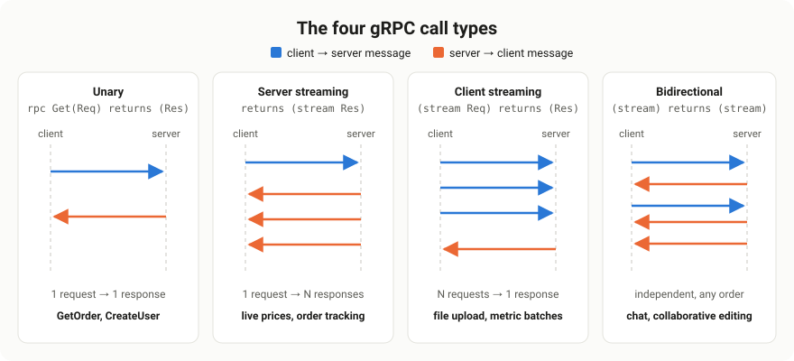
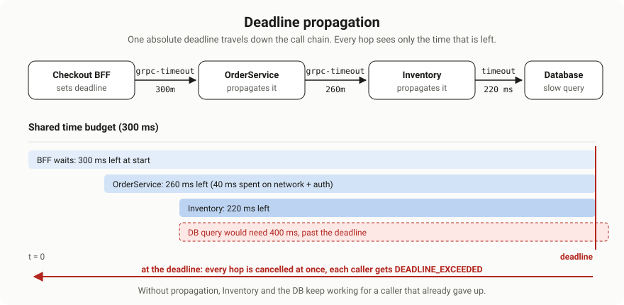
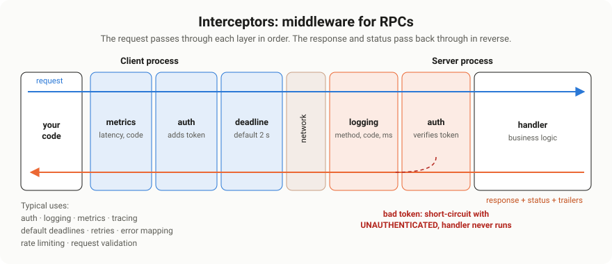

# gRPC Practical Patterns & Streaming

> Scope: the working half of gRPC. All four call types with runnable code, flow control and
> backpressure, deadlines and cancellation with propagation, interceptors, the status code model
> and rich errors, retries, and the production patterns that keep streams healthy.
>
> Source: extracted and reorganised from `0. md/DOCUMENTATIONS ...md` (and its HTML twin) →
> `GRAPHQL, gRPC… > gRPC` (Overal, Docs, FAANG questions, Custom QA, 50 Q&A) and
> `Handling Failures and Fault Mode > gRPC Failure handling`. Gaps were filled from grpc.io and the
> gRPC proposals.
>
> **Everything here was executed.** The service in this document was built and run against
> @grpc/grpc-js 1.14.4 on Node.js 24.15.0, and 36 behavioural checks pass: the four call types,
> deadline propagation, cancellation, backpressure, interceptor ordering, rich errors, retries and
> message limits. Where behaviour differs from the common wisdom, the measured result is stated.
> Schema and encoding questions are covered in
> [Protocol Buffers & gRPC Deep Dive](../7.%20PROTOBUF_GRPC_DEEP_DIVE/README.md).

---

## 0. What this document covers

| Topic | One-line summary |
| --- | --- |
| Call types | Unary, server streaming, client streaming, bidirectional, with code for each |
| Flow control | `write()` and `drain`, and what a slow consumer really does |
| Deadlines | Absolute time budgets that propagate down the call chain |
| Cancellation | How a client giving up reaches every downstream service |
| Metadata | Headers and trailers, including binary values |
| Interceptors | Middleware on both sides: auth, logging, metrics, default deadlines |
| Errors | 17 status codes, choosing the right one, and rich machine-readable details |
| Retries | Service-config policies, which codes are safe, and how deadlines bound them |
| Production | Keepalive, load balancing, health checks, reflection, graceful shutdown, limits |
| Streaming patterns | Resumption, heartbeats, stream lifetime, fan-out, backpressure |

---

# 1. The example service

Every snippet below comes from one small but complete service: an `OrderService` with all four RPC
types plus a downstream `InventoryService` used to demonstrate deadline propagation.

```text
demo/
  proto/
    demo/v1/order_service.proto     # the contract
    google/rpc/status.proto         # minimal copies, for rich error details
    google/rpc/error_details.proto
  load.js                           # loads the .proto once
  errors.js                         # rich errors + the handler guard
  interceptors-server.js            # auth + logging interceptors
  server.js                         # the four handlers
  client.js                         # interceptors, default deadlines, retries
```

```bash
npm install @grpc/grpc-js @grpc/proto-loader protobufjs
node server.js
```

## 1.1 The contract

`order_service.proto`

```proto
syntax = "proto3";

package demo.v1;

import "google/protobuf/timestamp.proto";

// The four RPC shapes, on one realistic service.
service OrderService {
  // Unary: one request, one response.
  rpc GetOrder(GetOrderRequest) returns (Order);

  // Server streaming: one request, a stream of status updates.
  rpc WatchOrder(WatchOrderRequest) returns (stream OrderEvent);

  // Client streaming: the client uploads many line items, gets one summary.
  rpc UploadItems(stream LineItem) returns (UploadSummary);

  // Bidirectional streaming: live support chat about an order.
  rpc Chat(stream ChatMessage) returns (stream ChatMessage);
}

// A downstream dependency, used to show deadline propagation.
service InventoryService {
  rpc CheckStock(CheckStockRequest) returns (CheckStockResponse);
}

enum OrderStatus {
  ORDER_STATUS_UNSPECIFIED = 0;
  ORDER_STATUS_PENDING = 1;
  ORDER_STATUS_PAID = 2;
  ORDER_STATUS_SHIPPED = 3;
  ORDER_STATUS_DELIVERED = 4;
}

message GetOrderRequest {
  string order_id = 1;
}

message Order {
  string order_id = 1;
  OrderStatus status = 2;
  repeated LineItem items = 3;
  int64 total_cents = 4;
  bool in_stock = 5;
}

message WatchOrderRequest {
  string order_id = 1;
}

message OrderEvent {
  string order_id = 1;
  OrderStatus status = 2;
  google.protobuf.Timestamp at = 3;
}

message LineItem {
  string sku = 1;
  int32 quantity = 2;
  int64 unit_price_cents = 3;
}

message UploadSummary {
  int32 item_count = 1;
  int64 total_cents = 2;
}

message ChatMessage {
  string from = 1;
  string text = 2;
}

message CheckStockRequest {
  repeated string skus = 1;
}

message CheckStockResponse {
  bool all_in_stock = 1;
}
```

## 1.2 Loading it

This service loads the `.proto` at runtime with `@grpc/proto-loader`, so there is no build step. The
loader options matter more than they look: `longs: String` prevents silent precision loss on `int64`,
and `enums: String` gives readable values.

`load.js`

```js
// load.js — load the .proto files once, share them everywhere.
const path = require("node:path");
const grpc = require("@grpc/grpc-js");
const protoLoader = require("@grpc/proto-loader");
const protobuf = require("protobufjs");

const PROTO_DIR = path.join(__dirname, "proto");

const packageDefinition = protoLoader.loadSync("demo/v1/order_service.proto", {
  includeDirs: [PROTO_DIR],
  keepCase: false,  // order_id -> orderId in JS
  longs: String,    // int64 -> string, so large numbers don't lose precision
  enums: String,    // enums as "ORDER_STATUS_PAID"
  defaults: true,   // unset fields come back as their zero values
  oneofs: true,
});
const { demo } = grpc.loadPackageDefinition(packageDefinition);

// Rich error details (google.rpc.Status) are encoded with plain protobufjs.
const rpcRoot = new protobuf.Root();
rpcRoot.resolvePath = (_origin, target) =>
  target.startsWith("google/protobuf/") ? target : path.join(PROTO_DIR, target);
rpcRoot.loadSync(["google/rpc/status.proto", "google/rpc/error_details.proto"]);

module.exports = {
  grpc,
  OrderService: demo.v1.OrderService,
  InventoryService: demo.v1.InventoryService,
  RpcStatus: rpcRoot.lookupType("google.rpc.Status"),
  BadRequest: rpcRoot.lookupType("google.rpc.BadRequest"),
};
```

---

# 2. The four call types



| Type | Signature | Use when | Example |
| --- | --- | --- | --- |
| Unary | `rpc M(Req) returns (Res)` | One question, one answer | `GetOrder`, `CreateUser` |
| Server streaming | `returns (stream Res)` | One request, many results over time | Live order tracking, tailing logs |
| Client streaming | `(stream Req) returns (Res)` | Many inputs, one summary | Uploads, metric batches |
| Bidirectional | `(stream Req) returns (stream Res)` | Ongoing two-way conversation | Chat, collaborative editing |

**Default to unary.** Streaming adds real complexity: lifecycle, backpressure, resumption and
partial failure. The notes put this well: bidirectional streaming is a bad idea for simple CRUD, and
should be reserved for genuinely real-time needs.

## 2.1 The server

`server.js`

```js
// server.js — OrderService (all four RPC types) + a downstream InventoryService.
const { setTimeout: sleep } = require("node:timers/promises");
const { grpc, OrderService, InventoryService } = require("./load.js");
const { invalidArgument, guardHandlers } = require("./errors.js");
const { authInterceptor, loggingInterceptor } = require("./interceptors-server.js");

const ORDERS = new Map([
  ["ord_1", { orderId: "ord_1", status: "ORDER_STATUS_PAID",
              items: [{ sku: "kb-01", quantity: 2, unitPriceCents: "4999" }], totalCents: "9998" }],
  ["ord_slow", { orderId: "ord_slow", status: "ORDER_STATUS_PENDING",
              items: [{ sku: "slow-sku", quantity: 1, unitPriceCents: "100" }], totalCents: "100" }],
]);

// Resolves true when the stream can take more data, false if the call was cancelled.
// Awaiting 'drain' alone hangs forever when the client cancels mid-wait.
function waitWritable(call) {
  if (call.cancelled) return Promise.resolve(false);
  return new Promise((resolve) => {
    const onDrain = () => { cleanup(); resolve(true); };
    const onCancel = () => { cleanup(); resolve(false); };
    const cleanup = () => { call.off("drain", onDrain); call.off("cancelled", onCancel); };
    call.once("drain", onDrain);
    call.once("cancelled", onCancel);
  });
}

// ---------------------------------------------------------------- inventory (downstream)
const inventoryHandlers = {
  async checkStock(call, callback) {
    if (call.request.skus.some((s) => s.startsWith("slow"))) {
      await sleep(500);                         // simulate a slow dependency
      if (call.cancelled) return;               // caller gave up: stop working, send nothing
    }
    callback(null, { allInStock: true });
  },
};

// ---------------------------------------------------------------- orders
function orderHandlers(inventory) {
  return {
    // Unary
    getOrder(call, callback) {
      const { orderId } = call.request;
      if (!orderId) {
        return callback(invalidArgument("order_id is required",
          [{ field: "order_id", description: "must not be empty" }]));
      }
      const order = ORDERS.get(orderId);
      if (!order) {
        return callback({ code: grpc.status.NOT_FOUND, details: `Order ${orderId} not found` });
      }
      // Pass our own deadline and cancellation down to the dependency.
      inventory.checkStock(
        { skus: order.items.map((i) => i.sku) },
        { parent: call, deadline: call.getDeadline() },
        (err, stock) => {
          if (err) return callback(err);          // DEADLINE_EXCEEDED, UNAVAILABLE... flow upward
          callback(null, { ...order, inStock: stock.allInStock });
        });
    },

    // Server streaming
    async watchOrder(call) {
      const { orderId } = call.request;
      if (!ORDERS.has(orderId)) {
        // Streams report errors by emitting them; grpc-js turns this into the final status.
        // (call.destroy(err) would tear down the stream without ever sending a status.)
        return call.emit("error", { code: grpc.status.NOT_FOUND, details: `Order ${orderId} not found` });
      }
      for (const status of ["ORDER_STATUS_PAID", "ORDER_STATUS_SHIPPED", "ORDER_STATUS_DELIVERED"]) {
        if (call.cancelled) return;               // client went away: stop producing
        const now = Date.now();
        const event = { orderId, status, at: { seconds: Math.floor(now / 1000), nanos: (now % 1000) * 1e6 } };
        if (!call.write(event) && !(await waitWritable(call))) return;   // backpressure, cancel-safe
        await sleep(Number(call.metadata.get("x-demo-interval-ms")[0] ?? 50));
      }
      call.end();                                 // OK status after the last message
    },

    // Client streaming
    uploadItems(call, callback) {
      let itemCount = 0;
      let totalCents = 0n;                        // int64 arrives as a string: use BigInt
      let failed = false;

      call.on("data", (item) => {
        if (failed) return;
        if (item.quantity <= 0) {
          failed = true;
          return callback(invalidArgument("invalid line item",
            [{ field: `items[${itemCount}].quantity`, description: "must be positive" }]));
        }
        itemCount += 1;
        totalCents += BigInt(item.unitPriceCents) * BigInt(item.quantity);
      });
      call.on("end", () => {
        if (!failed) callback(null, { itemCount, totalCents: totalCents.toString() });
      });
    },

    // Bidirectional streaming
    chat(call) {
      call.on("data", (msg) => {
        call.write({ from: "support", text: `Got it: "${msg.text}"` });
      });
      call.on("end", () => call.end());           // client finished sending -> we finish too
    },
  };
}

// ---------------------------------------------------------------- bootstrap
async function startServers({ log = () => {}, logError = console.error, validTokens = ["secret-token"] } = {}) {
  const bind = (server) => new Promise((resolve, reject) =>
    server.bindAsync("127.0.0.1:0", grpc.ServerCredentials.createInsecure(),
      (err, port) => (err ? reject(err) : resolve(port))));

  const inventoryServer = new grpc.Server();
  inventoryServer.addService(InventoryService.service, guardHandlers(inventoryHandlers, logError));
  const inventoryPort = await bind(inventoryServer);

  const inventory = new InventoryService(`127.0.0.1:${inventoryPort}`, grpc.credentials.createInsecure());

  const orderServer = new grpc.Server({
    interceptors: [loggingInterceptor(log), authInterceptor((t) => validTokens.includes(t))],
    "grpc.max_receive_message_length": 1024 * 1024,   // 1 MB instead of the 4 MB default
  });
  orderServer.addService(OrderService.service, guardHandlers(orderHandlers(inventory), logError));
  const orderPort = await bind(orderServer);

  return {
    address: `127.0.0.1:${orderPort}`,
    async stop() {
      inventory.close();
      await Promise.all([orderServer, inventoryServer].map((s) =>
        new Promise((resolve) => s.tryShutdown(() => resolve()))));
    },
  };
}

module.exports = { startServers };

if (require.main === module) {
  startServers({ log: console.log }).then(({ address }) => console.log(`OrderService on ${address}`));
}
```

## 2.2 The client

`client.js`

```js
// client.js — a production-shaped client: interceptors, default deadlines, retries.
const { grpc, OrderService } = require("./load.js");

// Adds the bearer token to every outgoing call.
const authInterceptor = (getToken) => (options, nextCall) =>
  new grpc.InterceptingCall(nextCall(options), {
    start(metadata, listener, next) {
      metadata.set("authorization", `Bearer ${getToken()}`);
      next(metadata, listener);
    },
  });

// Gives every unary call a deadline unless the caller set one. Streams are left alone.
const defaultDeadlineInterceptor = (ms) => (options, nextCall) => {
  const { requestStream, responseStream } = options.method_definition;
  if (!options.deadline && !requestStream && !responseStream) {
    options = { ...options, deadline: Date.now() + ms };
  }
  return nextCall(options);
};

// Records method, status and latency when each call finishes.
const metricsInterceptor = (record) => (options, nextCall) => {
  const started = Date.now();
  return new grpc.InterceptingCall(nextCall(options), {
    start(metadata, listener, next) {
      next(metadata, {
        onReceiveStatus(status, nextStatus) {
          record({ method: options.method_definition.path, code: grpc.status[status.code], ms: Date.now() - started });
          nextStatus(status);
        },
      });
    },
  });
};

// Retries are a channel-level policy: only safe, idempotent methods, only transient codes.
const serviceConfig = {
  loadBalancingConfig: [{ round_robin: {} }],
  methodConfig: [{
    name: [{ service: "demo.v1.OrderService", method: "GetOrder" }],
    retryPolicy: {
      maxAttempts: 4,
      initialBackoff: "0.1s",
      maxBackoff: "1s",
      backoffMultiplier: 2,
      retryableStatusCodes: ["UNAVAILABLE"],
    },
  }],
};

function createOrderClient(address, { getToken, record = () => {}, defaultDeadlineMs = 2000 } = {}) {
  return new OrderService(address, grpc.credentials.createInsecure(), {
    // Interceptors run outermost-first: metrics sees the final outcome, including retries.
    interceptors: [
      metricsInterceptor(record),
      authInterceptor(getToken),
      defaultDeadlineInterceptor(defaultDeadlineMs),
    ],
    "grpc.enable_retries": 1,
    "grpc.service_config": JSON.stringify(serviceConfig),
    "grpc.keepalive_time_ms": 30_000,
    "grpc.keepalive_timeout_ms": 10_000,
  });
}

// async/await wrapper for unary calls.
const unary = (client, method, request, options = {}) =>
  new Promise((resolve, reject) =>
    client[method](request, new grpc.Metadata(), options,
      (err, response) => (err ? reject(err) : resolve(response))));

module.exports = { createOrderClient, unary, serviceConfig };
```

## 2.3 Unary

The simplest shape, and the one to reach for first.

```js
// Callback style, as generated.
client.getOrder({ orderId: "ord_1" }, (err, order) => {
  if (err) return console.error(grpc.status[err.code], err.details);
  console.log(order.status);
});

// Promise wrapper, from client.js.
const order = await unary(client, "getOrder", { orderId: "ord_1" });
```

The notes ask whether `async/await` works with gRPC in Node: yes, but only by wrapping the callback
in a promise, as `unary()` does. Other languages, such as Go and Java, offer blocking, async and
future-based stubs directly.

**Tested:** `int64` arrives as a string, `enum` as its name, and the downstream `InventoryService`
call is made with the caller's deadline attached.

## 2.4 Server streaming

The server writes many messages, then ends the stream. Three rules make it safe:

1. **Respect backpressure.** `call.write()` returning `false` means the buffer is full.
2. **Stop when the client leaves.** Check `call.cancelled` each iteration.
3. **Report errors by emitting them**, not by destroying the stream.

```js
// Consuming it: a Node readable stream, so for-await works.
try {
  for await (const event of client.watchOrder({ orderId: "ord_1" })) {
    console.log(event.status);
  }
} catch (err) {
  // An error arrives as a throw out of the loop.
  console.error(grpc.status[err.code], err.details);
}
```

> **Gotcha found while testing this document.** Reporting an error with
> `call.destroy({ code, details })` tears the stream down **without ever sending a gRPC status**, so
> the client hangs until its deadline. grpc-js only converts an error into a status when you emit it:
> `call.emit("error", { code, details })`. The `guardHandlers` wrapper in `errors.js` does this for
> you.

## 2.5 Client streaming

The client writes many messages and half-closes; the server replies once.

```js
const summary = await new Promise((resolve, reject) => {
  const call = client.uploadItems((err, res) => (err ? reject(err) : resolve(res)));
  for (const item of items) call.write(item);
  call.end();                       // half-close: "I'm done sending"
});
```

**Tested:** 1,000 streamed items produced one summary, with the `int64` total accumulated as a
`BigInt` to avoid precision loss. A validation failure on the second item returned
`INVALID_ARGUMENT` with a field path, and the server stopped accumulating.

The server can respond **before** the client finishes sending, which is how early validation
failures work. A client that keeps writing after that gets a `CANCELLED` or write error.

## 2.6 Bidirectional streaming

Both sides send independently on one stream. There is no request-response pairing unless you build
one, for example by putting a correlation ID in the message.

```js
const call = client.chat();
call.on("data", (msg) => console.log(`${msg.from}: ${msg.text}`));
call.on("end", () => console.log("server finished"));
call.write({ from: "alice", text: "where is my order?" });
call.write({ from: "alice", text: "thanks" });
call.end();
```

**Tested:** messages interleaved correctly, and the half-close from the client led to a clean end
from the server.

Design rules that prevent most bidi bugs:

- **Decide who ends first.** A common contract is: the client half-closes, then the server finishes.
- **Carry a correlation ID** if replies can arrive out of order.
- **Keep per-stream state small**; a stream pins memory on both sides for its whole life.
- **Don't use bidi as a message queue.** If you need durability, replay or fan-out to many consumers,
  use Kafka or RabbitMQ and keep gRPC for the request path.

---

# 3. Flow control and backpressure

HTTP/2 has per-stream flow control, so a sender cannot overwhelm the network. What that means for
**your code** is more subtle, and it was measured.

## 3.1 The server-side pattern

`call.write()` returns `false` when the outgoing buffer is full. The usual advice is to wait for
`drain`, but doing only that introduces a leak.

> **Gotcha found while testing this document.** If the client cancels while the server is waiting on
> `drain`, that event never fires: the handler is stuck forever, holding its closure and any
> resources. Measured: a handler parked on `await once(call, "drain")` was still parked long after
> the client had cancelled. Wait for **either** `drain` or `cancelled`:

```js
function waitWritable(call) {
  if (call.cancelled) return Promise.resolve(false);
  return new Promise((resolve) => {
    const onDrain = () => { cleanup(); resolve(true); };
    const onCancel = () => { cleanup(); resolve(false); };
    const cleanup = () => { call.off("drain", onDrain); call.off("cancelled", onCancel); };
    call.once("drain", onDrain);
    call.once("cancelled", onCancel);
  });
}

// in the handler
if (!call.write(event) && !(await waitWritable(call))) return;
```

**Tested:** streaming 20,000 one-kilobyte messages, `write()` returned `false` 1,250 times, every
wait resumed on `drain`, and all 20,000 arrived in order. The server's own memory stayed flat at
about 80 MB.

## 3.2 What a slow consumer actually does

| Measurement | Result |
| --- | --- |
| Client paused for 3 seconds, server sending 1 KB messages | Server wrote ~180,000 messages, about 180 MB |
| Server memory during that time | Flat, around 80 MB |
| Client memory during that time | Grew from ~125 MB to ~347 MB |

**Pausing a grpc-js client stream does not slow the sender.** The data keeps arriving and buffers in
the client's process. So:

- **The `write`/`drain` pattern protects the server**, which is what it is for.
- **It does not protect a slow client.** A consumer that can't keep up will grow its own heap until
  it dies.
- **Other implementations differ.** grpc-java exposes manual flow control, where the application
  requests messages explicitly, and grpc-go replenishes the receive window as the application reads.
  Don't assume Node's behaviour elsewhere, or the reverse.
- **For genuinely fast producers, add application-level flow control**: have the consumer request N
  more items over a bidirectional stream, the pattern used by reactive-streams style APIs.

## 3.3 Practical limits

- Keep individual messages small; the default receive limit is 4 MB, and huge messages hurt latency
  and memory. **Tested:** a 2 MB request against a 1 MB limit failed with `RESOURCE_EXHAUSTED`.
- For large payloads, stream chunks of 32 KB to 128 KB rather than one giant message.
- Bound the number of concurrent streams per connection; the HTTP/2 default is often 100.

---

# 4. Deadlines and cancellation

This is gRPC's best feature, and the notes are right to call its failure handling the strongest of
the three API styles.

## 4.1 Timeout vs deadline

- A **timeout** is a duration: "wait 5 seconds".
- A **deadline** is an absolute point in time: "be finished by 10:00:03.250".

gRPC works with deadlines. The client computes the remaining time and sends it as the `grpc-timeout`
header, so **every hop in the chain shares one budget** instead of each adding its own five seconds.

```js
// Both forms exist in grpc-js; the deadline is what travels.
client.getOrder(req, { deadline: Date.now() + 250 }, cb);
client.getOrder(req, { deadline: new Date("2026-09-15T10:00:03.250Z") }, cb);
```

## 4.2 Propagation



Propagation is not automatic in Node: pass the incoming call as `parent`, and its deadline along
with it.

```js
inventory.checkStock(
  { skus },
  { parent: call, deadline: call.getDeadline() },   // inherit budget + cancellation
  (err, stock) => { ... });
```

**Tested end to end:** a client deadline of 200 ms reached a downstream service two hops away
**within 2 ms of the original**, every hop was cancelled at once when it expired, and the caller got
`DEADLINE_EXCEEDED`.

## 4.3 Deadlines do not stop your code

> **Tested:** when the deadline expired, the downstream handler received a `cancelled` event, **but
> its function kept running to completion** and its callback was simply ignored.

A deadline frees the *caller*, not the *callee*. To actually stop work, check for cancellation:

```js
async function checkStock(call, callback) {
  await slowLookup();
  if (call.cancelled) return;            // nobody is waiting: stop, send nothing
  callback(null, { allInStock: true });
}
```

Check `call.cancelled` before expensive steps, and pass an abort signal into database and HTTP calls
so they stop too.

## 4.4 Choosing deadlines

- **Every unary call gets a deadline.** A call without one can hang forever. The client interceptor
  in `client.js` applies a default, which is the cheapest way to guarantee it.
- **Base the value on observed latency**, roughly the p99 plus headroom, not on a round number.
- **Budget down the chain.** If the edge allows 300 ms, an inner service should be given less, not
  more.
- **Don't put a short default deadline on long-lived streams.** The interceptor in `client.js`
  deliberately skips streaming methods. **Tested:** a 50 ms default would have killed a healthy
  180 ms stream; skipping streams let it complete.
- **Use keepalive and heartbeats for streams instead**, covered in section 8.

## 4.5 Client-initiated cancellation

```js
const stream = client.watchOrder({ orderId: "ord_1" });
stream.on("data", (e) => { if (done(e)) stream.cancel(); });
```

**Tested:** the client saw `CANCELLED`, and the server's loop observed `call.cancelled` and stopped
producing. Cancellation propagates to anything the handler called with `parent`, so an entire subtree
of work unwinds.

---

# 5. Metadata

Metadata is gRPC's equivalent of HTTP headers: key-value pairs travelling beside the message.

```js
// Client: send
const md = new grpc.Metadata();
md.set("authorization", "Bearer abc");
md.set("x-request-id", requestId);
client.getOrder(req, md, cb);

// Server: read, and send some back
function getOrder(call, callback) {
  const requestId = call.metadata.get("x-request-id")[0];
  const header = new grpc.Metadata();
  header.set("x-served-by", process.env.HOSTNAME ?? "local");
  call.sendMetadata(header);
  callback(null, order);
}
```

Rules worth knowing:

- **Keys are lowercase ASCII.** Values are strings, unless the key ends in `-bin`, which carries raw
  bytes and is base64-encoded on the wire automatically.
- **`grpc-` prefixed keys are reserved** for the protocol, such as `grpc-timeout`, `grpc-status` and
  `grpc-status-details-bin`.
- **Headers arrive before the messages; trailers arrive after.** Anything computed during the call,
  such as a final error detail, must go in trailers.
- **Metadata is not encrypted by itself.** Use TLS, and never put secrets in a `-bin` key expecting
  privacy.
- **Propagate tracing headers** such as `traceparent` through every hop.

---

# 6. Interceptors



Interceptors are middleware for RPCs, the notes' comparison to Express middleware is exactly right.
Typical uses: authentication, logging, metrics, tracing, default deadlines, retry bookkeeping, error
mapping and rate limiting.

## 6.1 Server side

`interceptors-server.js`

```js
// interceptors-server.js — cross-cutting concerns for every RPC on the server.
const { grpc } = require("./load.js");

// Rejects calls without a valid bearer token before any handler runs.
function authInterceptor(isValidToken) {
  return (methodDescriptor, call) =>
    new grpc.ServerInterceptingCall(call, {
      start(next) {
        next({
          onReceiveMetadata(metadata, nextMetadata) {
            const header = metadata.get("authorization")[0] ?? "";
            const token = String(header).replace(/^Bearer /, "");
            if (!isValidToken(token)) {
              call.sendStatus({ code: grpc.status.UNAUTHENTICATED, details: "Missing or invalid token" });
              return;
            }
            nextMetadata(metadata);
          },
        });
      },
    });
}

// Logs method, final status code and duration for every call.
function loggingInterceptor(log) {
  return (methodDescriptor, call) => {
    const started = process.hrtime.bigint();
    return new grpc.ServerInterceptingCall(call, {
      sendStatus(status, next) {
        const ms = Number(process.hrtime.bigint() - started) / 1e6;
        log({ method: methodDescriptor.path, code: grpc.status[status.code], ms: +ms.toFixed(1) });
        next(status);
      },
    });
  };
}

module.exports = { authInterceptor, loggingInterceptor };
```

**Tested:** a call with a bad token was rejected with `UNAUTHENTICATED` **before the handler ran**,
and the logging interceptor recorded method, final status code and duration for every call including
the rejected ones.

## 6.2 Client side

The three interceptors in `client.js` cover the common needs: metrics on the outcome, an auth token
on every request, and a default deadline for unary calls.

## 6.3 Ordering

**Tested** with three tagged interceptors:

```text
A:start → B:start → C:start → C:status → B:status → A:status
```

The request passes through the array **in order**, and the response and status come back **in
reverse**. So put cross-cutting observers first: the metrics interceptor listed first sees the final
outcome of everything inside it.

**Tested:** with a retry policy in force, a call that made 4 attempts was recorded by the metrics
interceptor **once**, with the total elapsed time including backoff. Interceptors sit above the retry
machinery, which is usually what you want for latency metrics, and means per-attempt visibility needs
server-side logging instead.

---

# 7. Error handling

## 7.1 The status model

Every call ends with a status: `OK` or one of 16 error codes, plus a message and optional trailing
metadata. A failed call is **not** signalled by the HTTP status, which stays 200.

| Code | # | Meaning | Usually retryable? |
| --- | --- | --- | --- |
| `OK` | 0 | Success | n/a |
| `CANCELLED` | 1 | The caller cancelled | No |
| `UNKNOWN` | 2 | Unmapped error, often an uncaught exception | No |
| `INVALID_ARGUMENT` | 3 | Bad request regardless of system state | No |
| `DEADLINE_EXCEEDED` | 4 | Ran out of time | Only with a fresh, larger budget |
| `NOT_FOUND` | 5 | The resource does not exist | No |
| `ALREADY_EXISTS` | 6 | The resource already exists | No |
| `PERMISSION_DENIED` | 7 | Authenticated but not allowed | No |
| `RESOURCE_EXHAUSTED` | 8 | Quota, rate limit or message too large | Yes, with backoff |
| `FAILED_PRECONDITION` | 9 | System state is wrong; don't retry until fixed | No |
| `ABORTED` | 10 | Concurrency conflict such as a transaction abort | Yes, at a higher level |
| `OUT_OF_RANGE` | 11 | Past the valid range, such as reading beyond EOF | No |
| `UNIMPLEMENTED` | 12 | Method not implemented | No |
| `INTERNAL` | 13 | A real bug or invariant violation | No |
| `UNAVAILABLE` | 14 | Transient: service down, connection lost | **Yes** |
| `DATA_LOSS` | 15 | Unrecoverable data loss or corruption | No |
| `UNAUTHENTICATED` | 16 | Missing or invalid credentials | No, refresh first |

The gRPC documentation notes that some codes are **never generated by the library**, only by
application code: `INVALID_ARGUMENT`, `NOT_FOUND`, `ALREADY_EXISTS`, `FAILED_PRECONDITION`,
`ABORTED`, `OUT_OF_RANGE` and `DATA_LOSS`. So when you see one, your own code, or the service you
called, produced it deliberately.

## 7.2 Choosing between the confusing ones

- **`INVALID_ARGUMENT` vs `FAILED_PRECONDITION`:** the argument is wrong no matter what the system
  state is, versus the argument is fine but the system isn't ready, such as deleting a non-empty
  directory.
- **`FAILED_PRECONDITION` vs `ABORTED` vs `UNAVAILABLE`:** don't retry, retry at a higher level after
  resolving a conflict, retry the same call with backoff.
- **`NOT_FOUND` vs `PERMISSION_DENIED`:** returning `NOT_FOUND` avoids revealing that a resource
  exists.
- **`UNKNOWN` vs `INTERNAL`:** `UNKNOWN` usually means an exception escaped. Map it to something
  meaningful.

## 7.3 Rich, machine-readable errors

A code plus a sentence is often not enough. The standard extension is `google.rpc.Status` carried in
the `grpc-status-details-bin` trailer, holding typed details such as `BadRequest`, `RetryInfo`,
`QuotaFailure` or `ErrorInfo`.

`errors.js`

```js
// errors.js — build and read gRPC errors with rich, machine-readable details.
const { grpc, RpcStatus, BadRequest } = require("./load.js");

const DETAILS_KEY = "grpc-status-details-bin";

// Server side: an error object grpc-js understands, carrying google.rpc.BadRequest.
function invalidArgument(message, fieldViolations) {
  const badRequest = BadRequest.encode(BadRequest.fromObject({ fieldViolations })).finish();
  const status = RpcStatus.encode(RpcStatus.fromObject({
    code: grpc.status.INVALID_ARGUMENT,
    message,
    details: [{ type_url: "type.googleapis.com/google.rpc.BadRequest", value: badRequest }],
  })).finish();

  const metadata = new grpc.Metadata();
  metadata.set(DETAILS_KEY, Buffer.from(status)); // "-bin" keys carry raw bytes
  return { code: grpc.status.INVALID_ARGUMENT, details: message, metadata };
}

// Client side: turn an error back into plain objects.
function readErrorDetails(err) {
  const [raw] = err.metadata?.get(DETAILS_KEY) ?? [];
  if (!raw) return [];
  return RpcStatus.decode(raw).details.map((any) =>
    any.type_url.endsWith("/google.rpc.BadRequest")
      ? { type: "BadRequest", ...BadRequest.toObject(BadRequest.decode(any.value)) }
      : { type: any.type_url });
}

// Wrap every handler so exceptions become a proper status instead of a leak or a hang.
//  - grpc-js sends a synchronous throw to the client as UNKNOWN *with the raw message*.
//  - a rejected async handler sends nothing: the client waits for its deadline, and the
//    unhandled rejection can crash the process.
// Errors that already carry a gRPC code pass through; anything else becomes a generic INTERNAL.
function guardHandlers(handlers, logError = console.error) {
  const toStatus = (err) => {
    if (Number.isInteger(err?.code) && err.code > 0 && err.code <= 16) return err;
    logError(err);                                   // full detail stays server-side
    return { code: grpc.status.INTERNAL, details: "Internal server error" };
  };
  return Object.fromEntries(Object.entries(handlers).map(([name, handler]) => [name,
    (call, callback) => {
      const fail = (err) => {
        const status = toStatus(err);
        if (typeof callback === "function") callback(status);   // unary, client streaming
        else call.emit("error", status);                         // server streaming, bidi
      };
      try {
        const result = handler(call, callback);
        if (typeof result?.then === "function") result.catch(fail);
      } catch (err) {
        fail(err);
      }
    }]));
}

module.exports = { invalidArgument, readErrorDetails, guardHandlers };
```

**Tested:** an empty `order_id` produced `INVALID_ARGUMENT`, and the client decoded exactly
`[{ type: "BadRequest", fieldViolations: [{ field: "order_id", description: "must not be empty" }] }]`.

## 7.4 Uncaught exceptions: two bad defaults

> **Tested, and both are traps.**
>
> - **A synchronous `throw` in a handler** is sent to the client as `UNKNOWN` **with the raw
>   exception message**. A message such as `boom: secret db password in message` goes straight over
>   the wire to the caller.
> - **A rejected async handler sends nothing at all.** The client waits out its full deadline, and
>   without a deadline it waits forever. Meanwhile Node raises an `unhandledRejection`, which
>   terminates the process under the default settings.

The `guardHandlers` wrapper in `errors.js` fixes both, and `server.js` applies it to every service.
**Tested:** the synchronous throw became `INTERNAL` with a generic message; the async rejection became
`INTERNAL` in 9 ms instead of hanging; an error already carrying a gRPC code passed through unchanged;
a stream that failed mid-flight delivered its first message then `INTERNAL`; and the real messages
appeared only in the server log.

## 7.5 Failure modes and defences

The notes list gRPC's failure modes as connection drops, deadline exceeded, stream interruption and
backpressure issues. Matching defences:

| Failure | Defence |
| --- | --- |
| Connection drop | `UNAVAILABLE` plus a retry policy; keepalive to detect dead connections early |
| Deadline exceeded | Realistic deadlines, propagation, and cancellation checks in handlers |
| Stream interruption | Resumable streams with a cursor, section 9 |
| Backpressure | `write`/`drain` with cancel-awareness, section 3 |
| Overload | `RESOURCE_EXHAUSTED` plus rate limiting; load shedding |
| Bad input | `INVALID_ARGUMENT` with `BadRequest` details |
| Bugs | `guardHandlers`, generic `INTERNAL`, detailed server-side logs |

---

# 8. Retries and reliability

## 8.1 Two kinds of retry

- **Transparent retries** happen automatically when an RPC never reached the server's application
  logic, for example it failed while leaving the client. These are always safe.
- **Configured retries** come from a **service config** retry policy and apply to failures the server
  did see.

The notes say gRPC has "automatic retry policies". More precisely: retries are **enabled** by
default, but there is **no default policy**, so without configuration only the transparent case is
retried.

## 8.2 A policy, as used in `client.js`

```js
const serviceConfig = {
  methodConfig: [{
    name: [{ service: "demo.v1.OrderService", method: "GetOrder" }],  // only this method
    retryPolicy: {
      maxAttempts: 4,
      initialBackoff: "0.1s",
      maxBackoff: "1s",
      backoffMultiplier: 2,
      retryableStatusCodes: ["UNAVAILABLE"],
    },
  }],
};
```

**Tested results:**

- A server returning `UNAVAILABLE` twice then succeeding: the call **succeeded on attempt 3**, and
  retried attempts carried the `grpc-previous-rpc-attempts` header with values `1` and `2`.
- A server returning `NOT_FOUND`: **exactly one attempt**, because the code isn't in the list.
- A server always returning `UNAVAILABLE`: 4 attempts, then `UNAVAILABLE` to the caller.
- **One deadline bounds every attempt.** With a 250 ms deadline against an always-failing server, the
  call gave up after 252 ms and 2 attempts with `DEADLINE_EXCEEDED`. The deadline is not per attempt.

## 8.3 Rules

- **Only retry idempotent methods.** Name them explicitly; never apply a blanket policy to every
  method, or a retried `CreateOrder` becomes two orders. For non-idempotent work, add an idempotency
  key to the request and deduplicate server-side.
- **Only retry transient codes.** `UNAVAILABLE` nearly always; `RESOURCE_EXHAUSTED` sometimes, with
  longer backoff. Never `INVALID_ARGUMENT`, `NOT_FOUND` or `PERMISSION_DENIED`.
- **Always keep a deadline**, since it is what stops retries from piling up.
- **Add retry throttling.** A `retryThrottling` block in the service config stops a struggling
  service being hammered by the whole fleet, the gRPC equivalent of a retry budget.
- **Consider hedging** for latency-critical reads: send the same request to a second server after a
  delay and take the first answer. Only for idempotent methods.

## 8.4 Circuit breakers

gRPC has no built-in circuit breaker. Use a client interceptor that tracks failures per target and
fails fast with `UNAVAILABLE` once a threshold is crossed, or let a service mesh such as Istio or
Envoy do it with outlier detection.

---

# 9. Streaming patterns in practice

## 9.1 Resumable streams

The notes list "streaming recovery: resume streams" as a gRPC feature. It is **not** built in. If a
stream breaks, the client gets an error and must start a new call. Make that cheap by designing for
it:

```proto
message WatchOrderRequest {
  string order_id = 1;
  uint64 from_sequence = 2;   // resume after the last event the client processed
}

message OrderEvent {
  uint64 sequence = 1;
  // ...
}
```

The client records the last `sequence` it handled and sends it on reconnect; the server replays from
there. This is the same idea as Kafka offsets or the SSE `Last-Event-ID` header. Without it,
reconnection silently loses events.

## 9.2 Heartbeats and idle streams

A stream with no traffic can be closed by a proxy or NAT device without either side noticing. Two
defences:

- **Transport keepalive**, which pings the connection:

```js
const client = new OrderService(address, credentials, {
  "grpc.keepalive_time_ms": 30_000,          // ping after 30 s idle
  "grpc.keepalive_timeout_ms": 10_000,       // no pong in 10 s: connection is dead
  "grpc.keepalive_permit_without_calls": 1,
});
```

Servers must permit that rate, with `grpc.http2.min_time_between_pings_ms` and
`grpc.http2.min_ping_interval_without_data_ms`, or they will send `GOAWAY` with
`too_many_pings`. Agree the values on both sides.

- **Application heartbeats**, an `OrderEvent` with a `heartbeat` variant every N seconds, which also
  tells the client the stream is alive and healthy.

## 9.3 Stream lifetime

Long-lived streams pin clients to a specific server, which blocks rebalancing and rolling deploys.
Bound them deliberately:

- `grpc.max_connection_age_ms` and `grpc.max_connection_age_grace_ms` on the server recycle
  connections so load can be redistributed.
- Have clients reconnect on a schedule with jitter, resuming with `from_sequence`.
- Treat a clean end of stream as normal, not an error.

## 9.4 Fan-out

One stream per subscriber means the server holds state per connection. For broadcast to many
consumers, put a real message bus behind the service, and let each gRPC stream be a thin subscriber
to it. Don't rebuild a durable broker on top of bidirectional streams.

## 9.5 Choosing a pattern

| Requirement | Reach for |
| --- | --- |
| Request and reply | Unary |
| Server pushes updates to one client | Server streaming, with resumption |
| Upload or batch ingest | Client streaming |
| Interactive two-way session | Bidirectional streaming |
| Durable, replayable events, many consumers | A message broker, not gRPC streaming |
| Browser needs live updates | SSE or WebSocket at the edge, gRPC behind it |

---

# 10. Production concerns

## 10.1 Connections and load balancing

- **Create one client per target and reuse it.** A client owns a channel and its connections;
  creating one per request leaks connections, which the notes list as a common production issue.
- **Layer 4 load balancers don't work well with gRPC.** One long-lived HTTP/2 connection carries all
  calls, so a TCP-level balancer pins a client to one backend and load arrives unevenly. Options:
  client-side load balancing with `round_robin` over a DNS name that returns all backend addresses,
  such as a Kubernetes headless service; a Layer 7 proxy such as Envoy or NGINX that balances per
  request; or a service mesh.

```js
const client = new OrderService(`dns:///orders.svc.cluster.local:50051`, credentials, {
  "grpc.service_config": JSON.stringify({ loadBalancingConfig: [{ round_robin: {} }] }),
});
```

## 10.2 Security

- **Use TLS**, `grpc.credentials.createSsl()`, and mTLS for service-to-service identity.
  `createInsecure()` belongs in tests and local development only, which is why this demo uses it.
- **Authenticate with metadata**, typically a JWT in `authorization`, verified in a server
  interceptor as shown above.
- **Authorise per method and per object** in the handler. An interceptor that only checks "is the
  token valid" is not authorisation.

## 10.3 Health checking and reflection

- **Health checking:** implement the standard `grpc.health.v1.Health` service so Kubernetes and load
  balancers can probe it, rather than inventing your own.
- **Server reflection:** lets tools discover your services without a local `.proto` copy. It makes
  `grpcurl` work, which is the answer to the notes' "debugging is harder than REST":

```bash
grpcurl -plaintext localhost:50051 list
grpcurl -plaintext -d '{"orderId":"ord_1"}' localhost:50051 demo.v1.OrderService/GetOrder
```

Enable reflection in development and internal environments; consider disabling it on
internet-facing servers.

## 10.4 Graceful shutdown

```js
process.on("SIGTERM", () => {
  server.tryShutdown(() => process.exit(0));   // stop accepting, let in-flight calls finish
});
```

`tryShutdown` drains; `forceShutdown` cuts everything off immediately. Pair draining with a
readiness probe that starts failing first, so no new traffic arrives.

## 10.5 Limits and compression

```js
new grpc.Server({
  "grpc.max_receive_message_length": 4 * 1024 * 1024,
  "grpc.max_send_message_length": 4 * 1024 * 1024,
});
```

Set limits deliberately on both client and server. Enable gzip for large messages, remembering that
compression costs CPU and, as measured in the companion document, gzip narrows Protobuf's size
advantage over JSON rather than widening it.

## 10.6 Observability

- **Server interceptor** for structured logs: method, status code, duration, request ID.
- **Metrics** per method: request rate, error rate by status code, and latency percentiles.
- **Tracing** with OpenTelemetry's gRPC instrumentation, propagating `traceparent` through metadata.
- Remember interceptors see one logical call; use server-side logs for per-attempt visibility.

## 10.7 Testing

The tests behind this document run a real server on an ephemeral port in-process, which is fast and
needs no mocks:

```js
const port = await new Promise((resolve, reject) =>
  server.bindAsync("127.0.0.1:0", grpc.ServerCredentials.createInsecure(),
    (err, p) => (err ? reject(err) : resolve(p))));
```

Test the error paths, not just the happy one: deadlines, cancellation, oversized messages, missing
handlers and bad tokens all have specific status codes worth asserting.

---

# 11. Corrections to the notes

| Notes say | Accurate version |
| --- | --- |
| Retries: "built-in support, automatic retry policies" | Retries are enabled but there is **no default policy**; without config only transparent retries happen |
| "Streaming recovery: resume streams" | Not built in; design a sequence number or cursor and resume explicitly |
| "Load balancing: built-in support" | Client-side policies exist, but the default is `pick_first`; Layer 4 balancers distribute gRPC badly |
| `client.call(request, { deadline: Date.now()+3000 })` | Correct for grpc-js; note the deadline is absolute and covers all retry attempts |
| "If a request exceeds its deadline the server stops processing" | The server is *notified*; handlers keep running unless they check `call.cancelled` (tested) |
| "Errors: status codes + messages" | Also `google.rpc.Status` details in `grpc-status-details-bin` for machine-readable errors |
| Error handling is simply "status codes" | Uncaught exceptions default to leaking the message (`UNKNOWN`) or hanging the call (async); guard handlers |
| gRPC N+1: "batch requests" | Right idea; add server-side batch RPCs such as `BatchGetOrders` to the contract |

---

# 12. Production checklist

## Contract
- [ ] Each RPC has its own request and response message
- [ ] Package is versioned, such as `demo.v1`
- [ ] Streaming is used only where it earns its complexity
- [ ] Streamed events carry a sequence number so clients can resume

## Calls
- [ ] Every unary call has a deadline, applied by default in an interceptor
- [ ] Deadlines propagate to downstream calls with `parent`
- [ ] Handlers check `call.cancelled` before expensive work
- [ ] Long-lived streams have keepalive and heartbeats, not short deadlines

## Errors
- [ ] Handlers are wrapped so exceptions become `INTERNAL`, never a leaked message or a hang
- [ ] Status codes are chosen deliberately, not all `INTERNAL` or `UNKNOWN`
- [ ] Validation failures return `INVALID_ARGUMENT` with `BadRequest` details
- [ ] Server streams report errors by emitting them, never by destroying the call

## Reliability
- [ ] Retry policy names specific idempotent methods and retryable codes only
- [ ] Retry throttling or a circuit breaker protects failing dependencies
- [ ] Non-idempotent RPCs carry an idempotency key
- [ ] Message size limits are set on both sides

## Operations
- [ ] One client per target, reused; no client per request
- [ ] Load balancing is client-side `round_robin` or a Layer 7 proxy
- [ ] `grpc.health.v1.Health` implemented and probed
- [ ] `SIGTERM` triggers `tryShutdown` after readiness starts failing
- [ ] TLS everywhere; tokens verified in an interceptor; authorisation in handlers
- [ ] Logs, metrics by status code, and traces propagated through metadata

---

# 13. Q&A

### Call types

**What are the four gRPC call types?**
Unary, server streaming, client streaming and bidirectional streaming.

**When should you use bidirectional streaming?**
Only for genuinely interactive, real-time exchanges such as chat. It is the wrong tool for CRUD.

**Is gRPC synchronous or asynchronous?**
Both, depending on the generated stub. In Node the API is callback and stream based; wrap unary calls
in a promise to use `async/await`.

**How do you consume a server stream in Node?**
It's a readable stream: attach `data`, `end` and `error` listeners, or use `for await`, which throws
the gRPC error out of the loop.

**Who ends a bidirectional stream?**
Whatever the contract says. A common rule is that the client half-closes with `end()` and the server
then finishes.

### Deadlines and cancellation

**What is the difference between a timeout and a deadline?**
A timeout is a duration; a deadline is an absolute time. gRPC propagates the deadline, so one budget
covers the whole call chain.

**What happens when a deadline expires?**
The caller gets `DEADLINE_EXCEEDED` and downstream calls are cancelled. The server handler is
notified but keeps running unless it checks `call.cancelled`.

**How do you propagate a deadline in Node?**
Pass `{ parent: call, deadline: call.getDeadline() }` when making the downstream call.

**Should streams get a default deadline?**
No. A default deadline kills healthy long-lived streams; use keepalive and heartbeats instead.

**How does a client cancel a call?**
`call.cancel()`. The server sees `cancelled`, and the cancellation propagates to child calls.

### Errors and status codes

**How does gRPC report errors?**
A status code and message in the trailers, plus optional `google.rpc.Status` details in
`grpc-status-details-bin`. The HTTP status stays 200.

**What does `DEADLINE_EXCEEDED` mean?**
The call didn't finish within its deadline.

**What does `UNAVAILABLE` mean?**
The service couldn't be reached or is transiently down. It is the main retryable code.

**Which codes never come from the library?**
`INVALID_ARGUMENT`, `NOT_FOUND`, `ALREADY_EXISTS`, `FAILED_PRECONDITION`, `ABORTED`, `OUT_OF_RANGE`
and `DATA_LOSS`. Seeing one means application code produced it.

**What happens if a handler throws?**
In grpc-js a synchronous throw becomes `UNKNOWN` with the raw message exposed to the client, and a
rejected async handler sends nothing at all. Wrap handlers to return `INTERNAL` instead.

**What happens if a method is in the `.proto` but not implemented?**
The server still starts, and calls to it return `UNIMPLEMENTED`.

### Retries and reliability

**Does gRPC retry automatically?**
Only transparent retries for RPCs that never reached the server. Anything else needs a retry policy
in the service config.

**Which methods should have a retry policy?**
Idempotent ones only, named explicitly.

**Does a deadline apply per attempt or to the whole call?**
The whole call. Tested: a 250 ms deadline stopped retrying after 252 ms with `DEADLINE_EXCEEDED`.

**How many times does an interceptor see a retried call?**
Once. Interceptors sit above the retry machinery, so latency metrics include all attempts and
backoff.

**What is hedging?**
Sending the same idempotent request to another server after a delay and using whichever response
arrives first.

### Streaming and production

**How does backpressure work?**
`write()` returns `false` when the buffer is full; wait for `drain`, and also for `cancelled`, or the
handler leaks when a client disappears.

**Does a slow client slow the server down?**
Measured in grpc-js: no. Pausing the client kept data flowing into the client's memory. Other
implementations expose stricter flow control.

**How do you resume a broken stream?**
Design for it: number the events, have the client remember the last one it processed, and replay from
there on reconnect.

**Why does gRPC load-balance badly behind a Layer 4 balancer?**
All calls share one long-lived HTTP/2 connection, so connection-level balancing pins a client to one
backend. Use client-side `round_robin` or a Layer 7 proxy.

**How do you debug a gRPC service?**
`grpcurl` with server reflection, logging interceptors, and status codes with rich details.

**How do you shut down without dropping calls?**
`server.tryShutdown()` on `SIGTERM`, after the readiness probe starts failing.

---

# 14. Quick revision sheet

| Topic | Remember |
| --- | --- |
| Unary | Default choice; always give it a deadline |
| Server streaming | Check `call.cancelled`; `write`/`drain`; `call.end()` |
| Client streaming | Client `end()` half-closes; server may answer early |
| Bidirectional | Independent directions; agree who ends first |
| Stream errors | `call.emit("error", status)`, never `destroy()` |
| Backpressure | Wait for `drain` **or** `cancelled`, else the handler leaks |
| Slow consumer | grpc-js buffers in the client; add app-level flow control |
| Deadline | Absolute, propagated with `parent`, covers all retry attempts |
| Cancellation | Notifies; it does not stop your code running |
| Metadata | Headers before, trailers after; `-bin` keys carry bytes |
| Interceptors | In order out, reverse back; they see one call, not each retry |
| Status codes | 17 of them; `UNAVAILABLE` is the retryable one |
| Rich errors | `google.rpc.Status` in `grpc-status-details-bin` |
| Exceptions | Guard every handler: leak or hang otherwise |
| Retries | Idempotent methods only, transient codes only, always with a deadline |
| Connections | One client per target, reused; L7 or client-side balancing |
| Shutdown | `tryShutdown` after readiness fails |

**One sentence each**

- The call type is a design decision about who talks when, and unary is right far more often than it
  feels.
- Deadlines and cancellation are gRPC's best feature, and they only work if every hop propagates them
  and every handler checks them.
- Most gRPC production incidents are not about encoding; they are missing deadlines, unguarded
  exceptions, retried non-idempotent calls, and connections that never rebalance.

---

# 15. References

- [gRPC core concepts](https://grpc.io/docs/what-is-grpc/core-concepts/), [status codes](https://grpc.io/docs/guides/status-codes/), [error handling](https://grpc.io/docs/guides/error/), [deadlines](https://grpc.io/docs/guides/deadlines/), [cancellation](https://grpc.io/docs/guides/cancellation/), [retry](https://grpc.io/docs/guides/retry/), [keepalive](https://grpc.io/docs/guides/keepalive/), [health checking](https://grpc.io/docs/guides/health-checking/), [reflection](https://grpc.io/docs/guides/reflection/)
- [gRFC A6: client retries](https://github.com/grpc/proposal/blob/master/A6-client-retries.md) and [gRFC A2: service configs](https://github.com/grpc/proposal/blob/master/A2-service-configs-in-dns.md)
- [gRPC over HTTP/2 protocol specification](https://github.com/grpc/grpc/blob/master/doc/PROTOCOL-HTTP2.md)
- [grpc-node examples, including interceptors](https://github.com/grpc/grpc-node/tree/master/examples)
- [Google API error model](https://google.aip.dev/193) and [google.rpc.Status](https://github.com/googleapis/googleapis/blob/master/google/rpc/status.proto)
- [grpcurl](https://github.com/fullstorydev/grpcurl)
- Versions used: @grpc/grpc-js 1.14.4, @grpc/proto-loader 0.8.1, protobufjs 8.8.0, Node.js 24.15.0

---

**Previous:** [Protocol Buffers & gRPC Deep Dive](../7.%20PROTOBUF_GRPC_DEEP_DIVE/README.md)

**Related:** [REST, RESTful APIs & Best Practices](../6.%20REST_RESTFUL_API_BEST_PRACTICES/README.md)
